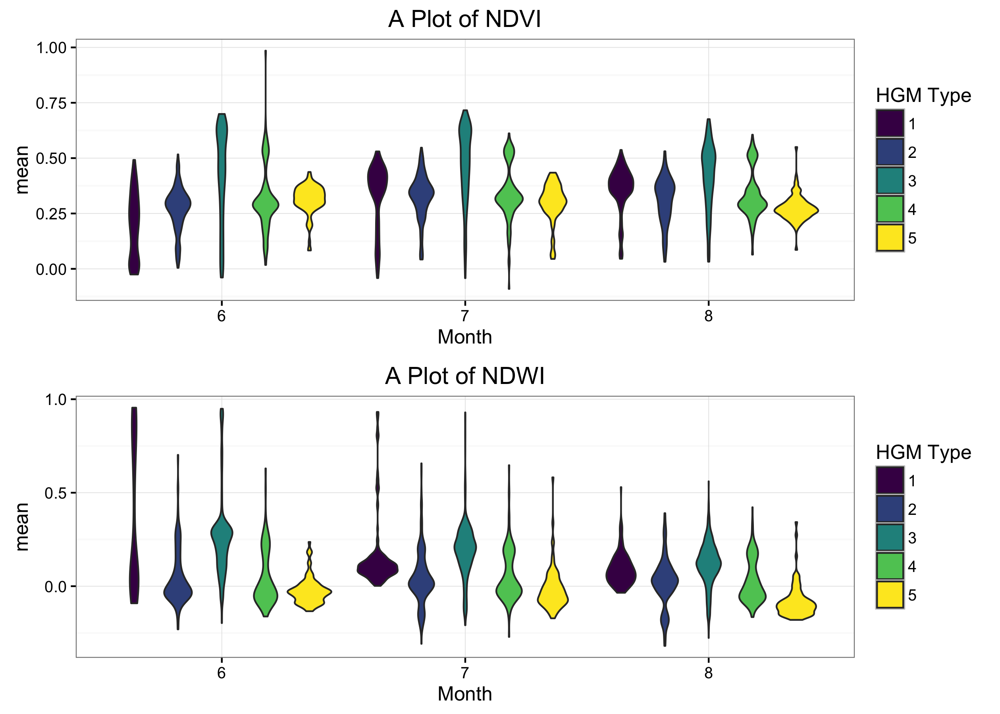
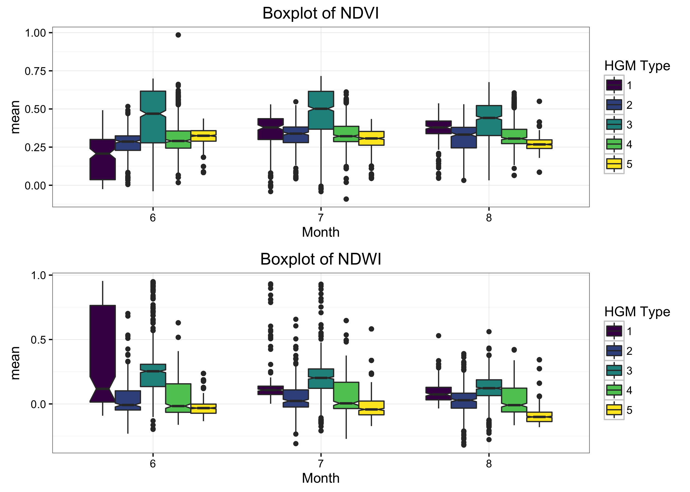
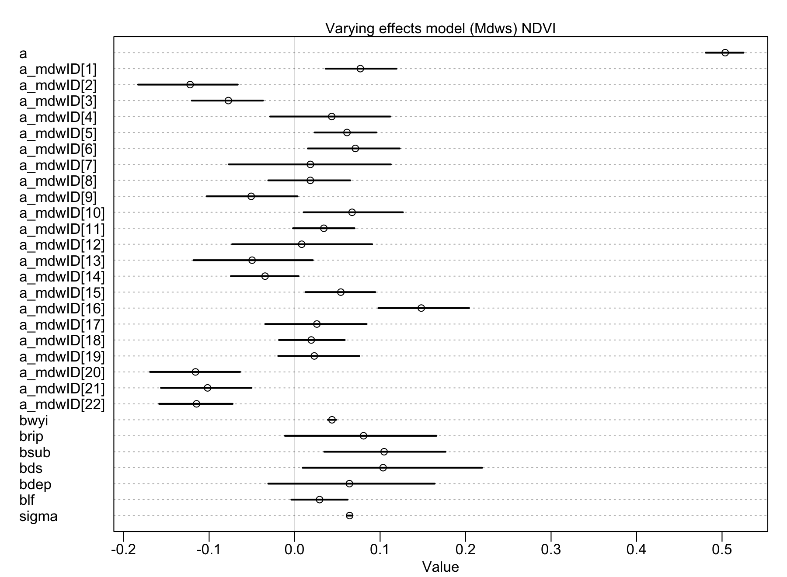
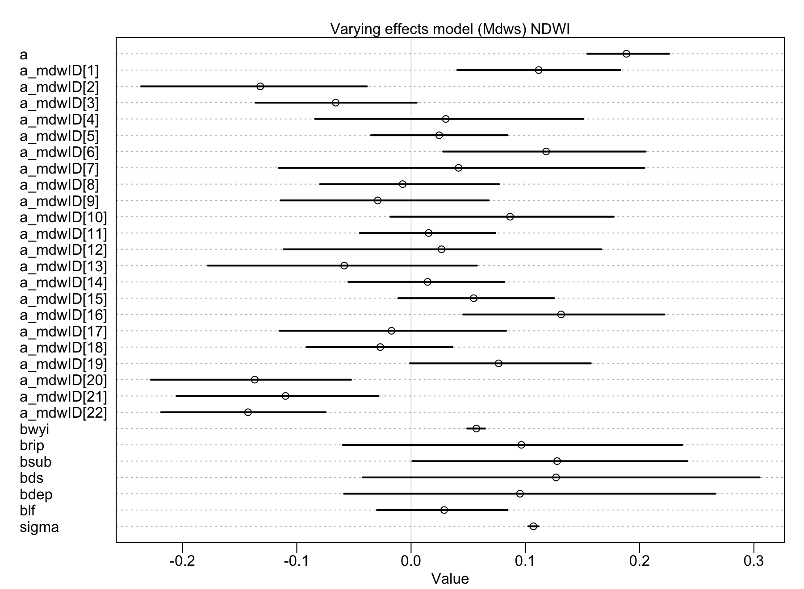
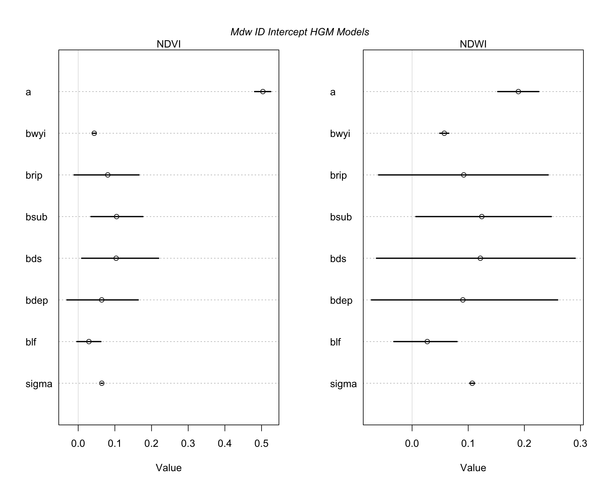

```{r setup, include=FALSE}
knitr::opts_chunk$set(echo = TRUE)
```

```{r load-libs, echo=FALSE}
suppressPackageStartupMessages({
  library(dplyr)
	library(ggplot2)
  library(viridis)
	library(ggthemes)
  library(lubridate)
	library(leaflet)
  library(readr)
  #library(quickmapr)
  library(rethinking)
  library(rgdal)
  library(DT)
  #library(ggrepel)
  })

# snmmc.mdws<-read_rds("./data_output/UCD_mdw_df.rds") # UCD Dataset for 17,039 meadows

#mod.hgm.mdws.gee<- read_rds("../data_output/mod_hgm_mdw_GEE.rds")

```

## Data Filtering and Merging

Take original data from previous and munge and merge with updated Dave Weixelman meadows that were selected.

```{r munge-orig-data, eval=F, echo=F}

wx.mdw<-read_rds("./data_output/wx_mdw_dat.rds") # weixelman data for 114 meadows

# rename and sort columns a bit
# Drop HGM source_type 8 (Dry), and combine classes 6 and 7, add elev col

wx.mdw <- wx.mdw %>% 
  select(PLOT, UCDavisObject_ID:PLOTNAME2, AREA_ACRE:Shape_Area) %>% 
  rename(Method=METHOD.y, UCDID=UCDavisObject_ID) %>% 
  mutate(hgm_class_comb = ifelse(source_type==8, NA, source_type), 
         hgm_class_comb = ifelse(source_type==7, 6, hgm_class_comb),
         elev_av_2100 = ifelse(ELEV_MEAN<2100, "<2100",">=2100"))

## make a quick meadows type table
mdw_types<-c("lacustrine fringe", "depressional",
             "discharge-slope-hillslope",
             "riparian-discharge-slope", "riparian",
             "subsurface-discharge-slope",
             "subsurface", "dry")
mdw_type_code<-c("lf", "dep", "ds", "rip-ds",
                 "rip", "sub-ds", "sub", "dry")
mdw_type_class<-seq(1,8,1)

# bind df
mdw_hgms<-data.frame("hgm_type"=mdw_types,"hgm_code"=mdw_type_code, "hgm_class"=mdw_type_class )

# now join this with original dataset
wx.mdw2<-inner_join(wx.mdw, mdw_hgms, by=c("source_type"="hgm_class"))
head(as.data.frame(wx.mdw2[,c(2,14,16,44:47)]))

# save for easy reload next time:
# write_rds(x = wx.mdw2, path ="~/Documents/github/meadow_hgm_waterchem/data_output/wx_mdw_dat2.rds")

```

First filter data to only selected data (`OK` and not `DRY` or `NOT OK`) based on Dave Weixelman's excel file from **June 05, 2016**. Several meadows were not accessible and were dropped, final list only includes data where there were UCDSNM_ID matched. Second, recombine and drop HGM classes (*drop dry category `8` and merge `6 & 7`*). Finally write back out as *.rds* file.

```{r load revised data, eval=F, echo=F}

wx.mdw<-read_rds("./data_output/wx_mdw_dat2.rds")

# this is the updated data version: 
wx.mdw.sub<-read_csv("./data/water_source_MDW_selection_2016_10_07.csv")
head(wx.mdw.sub)
wx.mdw.sub %>% ggplot + aes(x=hgm_classes, fill=elev_av_2100) + geom_bar()

# filter out the "NOT OK" and select cols of interest:
wx.mdw.sub <- wx.mdw.sub %>% 
  mutate(selected=1)
wx.mdw.sub %>% tally(selected) # should be 33 here!

# keep only selected and see how many matches occur:
dim(inner_join(wx.mdw, wx.mdw.sub, by="PLOT"))  # only 19 match up!
dim(inner_join(wx.mdw, wx.mdw.sub, by=c("UCDID"="UCDavisObject_ID")))  # 24 match up!
dim(merge(wx.mdw, wx.mdw.sub, by.x="UCDID", by.y="UCDavisObject_ID", all.y=T))

# this is the refiltered data...based on Dave's comments. Re-merge with dataset
wx.mdw.sub.UCID<-left_join(wx.mdw.sub, wx.mdw, by=c("UCDavisObject_ID"="UCDID")) %>% 
  distinct(UCDavisObject_ID,.keep_all = T) %>% 
  select(-ends_with(".y"), -c(STATE:Shape_Area)) %>% 
  rename_(.dots=setNames(names(.), gsub("\\.x", "", names(.))))

names(wx.mdw.sub.UCID)
summary(wx.mdw.sub.UCID)

# write to CSV and fill in blanks:
write_csv(wx.mdw.sub.UCID, path = "./data_output/wx_mdw_sub_UCID.csv")
# ok write this out to merge with GEE data later
# write_rds(x = wx.mdw.sub.UCID, path ="~/Documents/github/meadow_hgm_waterchem/data_output/wx_mdw_sub_UCDID.rds")
```

### Merge with Google Earth Engine Data

Need to merge with original GEE data after removing duplicated columns, then filter, rename a col, and save out.

```{r GEE clean and merge, eval=F, echo=F}
# HGM data ----
wx.mdw.sub<-read_csv(file = "./data_output/wx_mdw_sub_UCID.csv")
str(wx.mdw.sub)

# Make a list of duplicated column names (from SNMMC data) to filter from merge:
wx<-names(wx.mdw.sub)
gee<-names(snmmc.mdws)
allcols<-c(wx, gee)
col.dups <- allcols[duplicated(allcols)]

# now select columns that aren't duplicated before merging
library(magrittr) # to allow for special pipes %<>%
wx.mdw.sub %<>% select(-one_of(col.dups)) # writes back to same object
names(wx.mdw.sub)

# merge with GEE data
mdw.mod.dat<-inner_join(wx.mdw.sub, snmmc.mdws, by=c("UCDavisObject_ID"="ID"))
mdw.mod.dat %<>% select(-HGM_TYPE) %>%  dplyr::rename(., UCDID = UCDavisObject_ID)
names(mdw.mod.dat) # 47 variables, complete dataset

unique(mdw.mod.dat$UCDID) # should have 22!

## GET GEE DATA AND BIND NDVI w NDWI ------

folder='raw/'
get_csv <- list.files(folder, pattern = "*.csv")

mdws_gee <- data.frame()
for(i in 1:length(get_csv)) {
  csv<-read.csv(paste(folder,get_csv[i], sep=""), colClasses = "character")
  mdws_gee<-rbind(csv, mdws_gee)
  rm(csv)
  }

# Now Clean Up Rows
source(file='./scripts/functions/gee_data_cleanup.R')
# clean up df
mdws_gee_dat <- gee_tidy_df(mdws_gee)

#write_rds(mdws_gee_dat, path="./data_output/hgm_mdws_gee_dat.rds")
#mdws_gee_dat<-read_rds(path="./data_output/hgm_mdws_gee_dat.rds")

# remove temporary data
rm(mdws_gee)

## Filter and Join Mdws ------
mod.hgm.mdws.gee <- inner_join(mdw.mod.dat,mdws_gee_dat, by=c("UCDID"="ID"))
write_rds(mod.hgm.mdws.gee,"./data_output/mod_hgm_mdw_GEE.rds")
rm(snmmc.mdws, wx.mdw.sub, mdws_gee_dat)

```

### Final Dataset

The Weixelman dataset originally selected **24** meadows, of which there were only 17 unique UCD Meadow IDs, as several of the meadows (`PLOTNAME2`) actually fall within the same UCD ID. Merged these meadows with the NFWF Meadows to get final dataset, and am including some of the Kern high elevation sites (which are probably very difficult to visit, so may need to drop in future).

```{r get_water_year, eval=F, echo=F}

mod.hgm.mdws.gee<- read_rds("./data_output/mod_hgm_mdw_GEE.rds")
wx.mdws<-read_csv(file = "./data_output/wx_mdw_sub_UCID.csv")
str(wx.mdws)

# Add Water Year Cols
source("./scripts/functions/doy.R")

mod.hgm.mdws.gee$date<-ymd(mod.hgm.mdws.gee$date)
mod.hgm.mdws.gee$WY<-wtr_yr(mod.hgm.mdws.gee$date)
mod.hgm.mdws.gee$DOWY<-dowy(mod.hgm.mdws.gee$date)
mod.hgm.mdws.gee$DOY<-yday(mod.hgm.mdws.gee$date)
summary(mod.hgm.mdws.gee)

## GET SPATIAL DWR REGIONS FOR EACH MEADOW

dwr<- readOGR("./data/shps/DWR_HydrologicRegions-utm11.shp", layer="DWR_HydrologicRegions-utm11", verbose = F)
proj4string(dwr)

# Set Projection
wgs84<-CRS("+init=epsg:4326")
nad83<-CRS("+init=epsg:4269")
dwr<-spTransform(dwr, wgs84) # reproject
proj4string(dwr) # double check

# Get Attribute of DWR Polygon
library(dismo)
library(sp)

# make spatial dataframe of selected lat longs
xy <- mod.hgm.mdws.gee %>% distinct(UCDID, .keep_all = T) %>%
  dplyr::select(UCDID, LAT_DD, LONG_DD) 

xy.sp <- SpatialPoints(coords = xy[,c("LONG_DD", "LAT_DD")], proj4string = wgs84)
spdf.sp <- SpatialPointsDataFrame(xy.sp, xy)
str(spdf.sp)

# plot(dwr) # this is slow
# plot(spdf.sp, cex=2, col="red", pch=16, add=T) # this is slow

xy.over<-cbind(xy, over(spdf.sp, dwr[,4:5]))
#write_rds(xy.over, "./data_output/mdw_pts_w_dwr_region.rds")


xy.over <- read_rds("./data_output/mdw_pts_w_dwr_region.rds")
xy.over

## SO JUST COMBINE TO NORTH/SOUTH FOR NOW. GET TULARE DATA LATER
# South Lahontan/Tulare/: Use San Joaquin
# North Lahontan: Use Sacramento
xy.dwr <- xy.over %>% 
  mutate(dwr_name=ifelse(as.numeric(HR_CODE)==9 |
                           as.numeric(HR_CODE)==7, "SJR", "SAC"),
         dwr_code=ifelse(dwr_name=="SJR", 06, 05))
xy.dwr <- xy.dwr %>% dplyr::select(UCDID, HR_CODE:dwr_code)

# join this with full data set
mod.hgm <- inner_join(mod.hgm.mdws.gee, xy.dwr, by="UCDID")
names(mod.hgm)

## Add WYT
wy <- read.csv("./data/wy_type.csv")
wy <- dplyr::select(wy, WY, SAC_Index, SAC_maf_WYsum, SAC, SJ_maf_WYsum, SJ_Index, SJ)
head(wy)

## MERGE WITH FINAL DATA
mod.hgm <- inner_join(mod.hgm, wy, by="WY") # trims out 2016 b/c WY only to 2015

names(mod.hgm)

#write_rds(mod.hgm, path="./data_output/hgm_gee_mdws_dat.rds")

```

The final GEE dataset merged with Weixelman selected meadows gives us 22 meadows with unique UCDIDs, including 5 of the NFWF Meadows. See Table below for first few rows of dataset to see all variables.

```{r final dataset, eval=T, echo=T}

mod.hgm<-read_rds(path="./data_output/hgm_gee_mdws_dat.rds")
#names(mod.hgm)
datatable(head(as.data.frame(mod.hgm)), 
              class="compact row-border stripe",
              caption=htmltools::tags$caption(
                style = 'caption-side: bottom; text-align: left;',
                htmltools::em('Table 1. '), 
                htmltools::em('First Few Rows of All Data Used for Model')))

```

#### HGM Types

The HGM Types were collapsed from the initial 8 to a final 6 types. See *Table 2 through Table 4* below for more information on the meadow HGM types, and which meadows were selected (by HGM type). 

```{r HGMtypes, eval=T, echo=F}
library(DT)

mdw_types<-c("lacustrine fringe", "depressional",
             "discharge-slope-hillslope",
             "riparian-discharge-slope", "riparian",
             "subsurface-discharge-slope",
             "subsurface", "dry")
mdw_type_code<-c("lf", "dep", "ds", "rip-ds",
                 "rip", "sub-ds", "sub", "dry")
mdw_type_class<-seq(1,8,1)

# bind df
mdw_hgms<-data.frame("hgm_type"=mdw_types,"hgm_code"=mdw_type_code, "hgm_class"=mdw_type_class )

DT::datatable(mdw_hgms, rownames = FALSE,
              class="compact row-border stripe",
              caption=htmltools::tags$caption(
                style = 'caption-side: bottom; text-align: center;',
                htmltools::em('Table 2. '), 
                htmltools::em('All HGM Types used from Weixelman et al. 2011')
              ), colnames = c("HGM Type"=1, "HGM Code"=2, "HGM Class"=3)
) %>% DT::formatStyle('HGM Type',  color = 'black', 
                  backgroundColor = 'lightblue', fontWeight = 'bold')

```

```{r hgmtypes_revised, eval=F, echo=F}

mdw_hgm_rev<-mdw_hgms[c(1:5,7),]
mdw_hgm_rev[6,3]<-6

# add counts of total meadows per group:
# mod.hgm  %>% distinct(UCDID,.keep_all = T) %>% group_by(hgm_class_comb)  %>% tally

mdw_hgm_rev$tot_mdws<-c(2,4,5,3,4,4)

# Table of HGM Types and Total Meadows per Type
DT::datatable(mdw_hgm_rev,rownames = FALSE,
              class="compact row-border stripe",
              caption=htmltools::tags$caption(
                style = 'caption-side: bottom; text-align: center;',
                htmltools::em('Table 3. '), 
                htmltools::em('Revised HGM Types for selection of meadows')
              ), colnames = c("HGM Type"=1, "HGM Class"=2, "HGM Code"=3, "Total Meadows"=4)
) %>% formatStyle(columns = 'HGM Type',  color = 'black',fontWeight='bold') %>% 
  formatStyle(columns = 'HGM Code',color = 'gray', fontWeight = 'bold',
                  backgroundColor = styleInterval(cuts=c(1,2,3,4,5),
                                                  values = c("#440154",
                                                             "#414487",
                                                             "#2a788e",
                                                             "#22a884",
                                                             "#7ad151",
                                                             "#fde725")))
```

## Plots

Finally, let's look at the data. This is NDVI and NDWI across 22 meadows for each HGM type for 3 months. Remember this is 30+ years (1984-2015) of 8-day LANDSAT composites, so distributions are very large. The total dataset is over 50,000 observations.

### Violin Plots

Violin plots are essentially boxplots showing densities or distributions over the data groups. Hard to interpret too much from these, but easier to understand the distribution of the data for each of these groupings (*HGM type and Month*) over all years (1984-2015).

```{r violin_plots, eval=F, echo=T}

mod.hgm$month <- month(mod.hgm$date)

# Violin Plots -------

# make a violin plot of NDVI
vio.ndvi<-ggplot(data=mod.hgm[mod.hgm$index=="NDVI" & mod.hgm$month>=6 & mod.hgm$month<9,], 
       aes(x=as.factor(month), y=mean, fill=as.factor(hgm_class_comb))) + 
  ggtitle("A Plot of NDVI") + xlab("Month") + guides(fill=guide_legend(title="HGM Type")) +
  geom_violin() + scale_fill_viridis(discrete = T) + 
  theme_bw() #+ facet_grid(month~.)

# make a violin plot of NDWI
vio.ndwi<-ggplot(data=mod.hgm[mod.hgm$index=="NDWI" & mod.hgm$month>=6 & mod.hgm$month<9,], 
       aes(x=as.factor(month), y=mean, fill=as.factor(hgm_class_comb))) + 
  ggtitle("A Plot of NDWI") + xlab("Month") + guides(fill=guide_legend(title="HGM Type")) +
  geom_violin() + scale_fill_viridis(discrete = T) + 
  theme_bw() #+ facet_grid(month~.)

vio_stack<-cowplot::plot_grid(vio.ndvi, vio.ndwi, align = "v",nrow = 2)
vio_stack

cowplot::save_plot("./fig_output/violin_ndvi_ndwi_jun-aug.png", plot = vio_stack, ncol = 2,base_aspect_ratio = 0.7, base_height = 6)


```



### Boxplots

 Here are the same data (MEANS of LANDSAT DATA) with the same groupings using notched boxplots to assess if medians are significantly different. Notches are used to compare groups; if the notches of two boxes do not overlap, this suggests that the medians are significantly different.

```{r boxplots, eval=F, echo=T}
mod.hgm$month <- month(mod.hgm$date)

# Boxplots -------

# make a box plot of NDVI
box.ndvi<-ggplot(data=mod.hgm[mod.hgm$index=="NDVI" & mod.hgm$month>=6 & mod.hgm$month<9,], 
       aes(x=as.factor(month), y=mean, fill=as.factor(hgm_code))) + ylim(c(-0.2,1))+
  ggtitle("Boxplot of NDVI") + xlab("Month") + guides(fill=guide_legend(title="HGM Type")) +
  geom_boxplot(notch = T) + scale_fill_viridis(discrete = T) + 
  theme_bw() #+ facet_grid(month~.)

box.ndvi8<-ggplot(data=mod.hgm[mod.hgm$index=="NDVI" & mod.hgm$month==8,], 
       aes(x=PLOT, y=mean, fill=as.factor(hgm_code))) + ylim(c(-0.2,1))+
  ggtitle("Boxplot of NDVI") + xlab("Meadow Plot") + guides(fill=guide_legend(title="HGM Type")) +
  geom_boxplot(notch = T, show.legend=F) + scale_fill_viridis(discrete = T) + 
  theme_bw() #+ facet_grid(month~.)
box.ndvi8

# make a box plot of NDWI
box.ndwi<-ggplot(data=mod.hgm[mod.hgm$index=="NDWI" & mod.hgm$month>=6 & mod.hgm$month<9,], 
       aes(x=as.factor(month), y=mean, fill=as.factor(hgm_code))) + ylim(c(-0.2,1))+
  ggtitle("Boxplot of NDWI") + xlab("Month") + #guides(fill=guide_legend(title="HGM Type")) +
  geom_boxplot(notch = T, show.legend=F) + scale_fill_viridis(discrete = T) + 
  theme_bw() #+ facet_grid(month~.)

# aug only
box.ndwi8<-ggplot(data=mod.hgm[mod.hgm$index=="NDWI" & mod.hgm$month==8,], 
       aes(x=PLOT, y=mean, fill=as.factor(hgm_code))) + ylim(c(-0.3,1))+
  ggtitle("Boxplot of NDWI") + xlab("Meadow Plot") + 
  guides(fill=guide_legend(title="HGM Type"), ncol=1, nrow=1) +
  geom_boxplot(notch = T, show.legend = T) + scale_fill_viridis(discrete = T) + 
  theme_bw() +  theme(axis.text.x = element_text(angle = 90, hjust = 1),
                      legend.position="top")
box.ndwi8

box_stack<-cowplot::plot_grid(box.ndvi, box.ndwi, align = "v",nrow = 2)
box_stack2<-cowplot::plot_grid(box.ndvi8, box.ndwi8, align = "v",nrow = 2)
box_stack2
cowplot::save_plot("../fig_output/box_ndvi_ndwi_aug.png", plot = box_stack2, ncol = 2,base_aspect_ratio = 0.7, base_height = 6)

cowplot::save_plot("../fig_output/box_ndvi_ndwi_jun-aug.png", plot = box_stack, ncol = 2,base_aspect_ratio = 0.7, base_height = 6)

```



In this case, it's interesting that the NDVI seems to parse HGM types out more significantly than the NDWI data, with the exception of the *subsurface* and *subsurface-discharge slope* types, which seem to be more clearly different than anything else in the NDWI data. 

### Plots by Water Year Type

Now that we have the data, we can also assess how these data may fluctuate across meadows and water year types. See figures below of Water Year Type and mean NDVI/NDWI for each HGM type. 

It appears there is some signal in the data during summer months, particularly for the `Lacustrine Fringe` and `Riparian` HGM types. The `Discharge Slope` appears to have a very large amount of variation inherently in all months across years (water year types), but model will hopefully help delineate if some of this variation can be explained by HGM types and landsat data.

```{r boxplots of Selected Mdws}
# Model Datasets
load("../data_output/model_datasets_Aug_max.rda")

plot.ndvi<-ggplot(data=dfVI,aes(x=as.factor(mdw_id), y=mean, fill=as.factor(hgm_class_comb))) + ylab("Max August NDVI") +
  ylim(c(-0.2,1))+ ggtitle("Max NDVI") + xlab("Meadow ID") +
  guides(fill=guide_legend(title="HGM Type")) +
  #stat_smooth(col="gray70",alpha=0.2) + 
  geom_boxplot()+ geom_point(pch=21, alpha=0.3) +
  scale_fill_viridis(discrete = T) + 
  theme_bw() #+ facet_grid(month~.)
plot.ndvi


plot.ndwi<-ggplot(data=dfWI,aes(x=as.factor(mdw_id), y=mean, fill=as.factor(hgm_class_comb))) + ylab("Max August NDWI") +
  ylim(c(-0.4,1))+ ggtitle("Max NDWI") + xlab("Meadow ID") +
  guides(fill=guide_legend(title="HGM Type")) +
  #stat_smooth(col="gray70",alpha=0.2) + 
  geom_boxplot()+ geom_point(pch=21, alpha=0.3) +
  scale_fill_viridis(discrete = T) + 
  theme_bw() #+ facet_grid(month~.)
plot.ndwi


```


```{r plots by WYT, eval=F, echo=F, fig.height=4, fig.width=5}

# Relevel the Water Year Type into appropriate order:
mod.hgm$SAC <- factor(mod.hgm$SAC, levels = c("W", "AN", "BN", "D", "C"))
mod.hgm$SJ <- factor(mod.hgm$SJ, levels = c("W", "AN", "BN", "D", "C"))

# make a plot of NDWI
ggplot(data=mod.hgm[mod.hgm$index=="NDWI" & 
                      mod.hgm$month>5 & 
                      mod.hgm$month<9,], 
       aes(as.factor(month), mean, fill=as.factor(hgm_type))) + 
  ggtitle("A Plot of NDWI by Water Year Type") + ylim(c(-0.1,0.8)) +
  geom_boxplot(notch = T) + scale_fill_viridis(direction = 1, discrete = T) +
  theme_bw() + facet_grid(SAC~.) + ylab("Mean") + xlab("Month")+
  guides(fill=guide_legend(title="HGM Type"))

ggplot(data=mod.hgm[mod.hgm$index=="NDVI" & 
                      mod.hgm$month>5 & 
                      mod.hgm$month<9,], 
       aes(as.factor(month), mean, fill=as.factor(hgm_code))) + 
  ggtitle("A Plot of NDVI by Water Year Type") + ylim(c(-0.1,0.8)) +
  geom_boxplot(notch = T) + scale_fill_viridis(direction = 1, discrete = T) +
  theme_bw() + facet_grid(SAC~.) + ylab("Mean") + xlab("Month")+
  guides(fill=guide_legend(title="HGM Type"))


# look at trends across weeks and water years
ggplot() + geom_smooth(data=mod.hgm[mod.hgm$index=="NDVI" & 
                                      mod.hgm$month>5 & mod.hgm$month<9,], 
                       aes(x=DOWY, y=mean, color=hgm_code), se=F)+
  geom_point(data=mod.hgm[mod.hgm$index=="NDVI" & mod.hgm$month>5 &
                            mod.hgm$month<9,], 
             aes(x=DOWY, y=mean, color=hgm_code))+
  guides(color=guide_legend(title="HGM Type"))+
  theme_bw()+ xlab("Water Year Day (June 1 through June 30)") +
  scale_color_viridis(discrete = T) + facet_grid(SAC~.)

```

## Make a Shiny Map of Sites

```{r leaflet-mdws, message=F, echo=F}
library(leaflet)

wx.mdws<-read_csv(file = "../data_output/wx_mdw_sub_UCID.csv")

m <- leaflet() %>% addTiles() %>% 
  #setView(lng = -120.8, lat = 39, zoom = 8) %>%  # set to Auburn/Colfax, zoom 5 for CA 
  addTiles(group = "OSM") %>%
  addProviderTiles("Stamen.TopOSMFeatures", group = "OSM Features") %>%
  addProviderTiles("Esri.WorldImagery", group = "ESRI Aerial") %>%
  addProviderTiles("Thunderforest.Landscape", group = "Topo") %>%
  hideGroup("OSM Features") %>% 
  

# proposed sites
  addCircleMarkers(data=wx.mdws, group="Weixelman Sites",
                   lng= ~LONG_DD, lat= ~LAT_DD,
                   popup=paste0("<b>Plot:</b> ", 
                                wx.mdws$PLOTNAME2, "<br>", "<b>HGM Type:</b> ",
                                wx.mdws$hgm_type, "<br>", "<b>UCD_ID:</b> ",
                                wx.mdws$UCDavisObject_ID, 
                                "<br>", "<b>Area_acres:</b> ",
                                wx.mdws$AREA_ACRE, "<br>", "<b>Elev_mean_m:</b> ",
                                wx.mdws$ELEV_MEAN),
                   stroke=TRUE, weight=0.6,radius=10,
                   fillOpacity = 0.8, color="black",
                   fillColor = "yellow") %>%
  
  # add controls for basemaps and data
  addLayersControl(
    baseGroups = c("OSM", "ESRI Aerial", "Topo"),
    overlayGroups = c("Weixelman Sites",
                      "OSM Features"),
    options = layersControlOptions(collapsed = T))

# Print Map
m

```

# Modeling

Make a simple mode of HGM type vs. WY and NDVI or NDWI, adjusting for individual meadows. Scale data first.

```{r scale model data, eval=F, echo=T}

# Scale Data
dff <- mod.hgm
names(dff)

# add month and WY column for modeling (combines both SAC and SJ based on location)
dff$month<-month(dff$date)
dff$dwr_name <- as.factor(dff$dwr_name)
dff$wyi <- ifelse(dff$dwr_name == "SAC", dff$SAC_Index, dff$SJ_Index)
summary(dff)

# Scale and center data:
dff$lf_s<- (dff$LF - mean(dff$LF)) / sd(dff$LF)
dff$rip_s<- (dff$Riparian - mean(dff$Riparian)) / sd(dff$Riparian)
dff$sub_s<- (dff$Subsurface - mean(dff$Subsurface)) / sd(dff$Subsurface)
dff$ds_s<- (dff$DS - mean(dff$DS)) / sd(dff$DS)
dff$dep_s<- (dff$Depressional - mean(dff$Depressional)) / sd(dff$Depressional)
dff$dry_s<- (dff$Dry - mean(dff$Dry)) / sd(dff$Dry)
dff$lat_s<- (dff$LAT_DD - mean(dff$LAT_DD)) / sd(dff$LAT_DD)
dff$mdw_id<-coerce_index(dff$UCDID)
dff$wyi_s<-(dff$wyi - mean(dff$wyi)) / sd(dff$wyi)
dff$edgecomplex_s<-(dff$EDGE_COMPL - mean(dff$EDGE_COMPL)) / sd(dff$EDGE_COMPL)
dff$domrock<-coerce_index(as.factor(dff$DOM_ROCKTY)) # shift factor to numeric
dff$vegmaj<-coerce_index(as.factor(dff$VEG_MAJORI)) # shift factor to numeric
dff$kf_s<-(dff$Kf - mean(dff$Kf)) / sd(dff$Kf)
dff$claytotR_s<-(dff$ClayTot_r - mean(dff$ClayTot_r)) / sd(dff$ClayTot_r)
dff$soilcomp<-coerce_index(as.factor(dff$COMP_NAME)) 
dff$flow_slope_s<-(dff$FLOW_SLOPE - mean(dff$FLOW_SLOPE)) / sd(dff$FLOW_SLOPE)
dff$elevmean_s<- (dff$ELEV_MEAN - mean(dff$ELEV_MEAN)) / sd(dff$ELEV_MEAN)
dff$catch_s<- (dff$CATCHMENT_ - mean(dff$CATCHMENT_)) / sd(dff$CATCHMENT_)
dff$shapearea_s<- (dff$Shape_Area - mean(dff$Shape_Area)) / sd(dff$Shape_Area)
dff$flowrange_s<- (dff$FLOW_RANGE - mean(dff$FLOW_RANGE))/ sd(dff$FLOW_RANGE)

# Look at Columns
names(dff)
dff %>% filter(index=="NDWI", month==8) %>% tally # count records for ndwi
dff %>% filter(index=="NDVI", month==8) %>% tally

# add month col and select max months
dfVI <- dff %>% 
  group_by(UCDID, WY, month) %>% 
  filter(index=="NDVI", month==8, mean==max(mean, na.rm=T)) %>%
  select(UCDID, mdw_id, WY, month, mean, hgm_class_comb, lf_s:lat_s,
         wyi_s:flowrange_s,LF:Depressional)
  
dfWI <- dff %>% 
  group_by(UCDID, WY, month) %>% 
  filter(index=="NDWI", month==8) %>% 
  filter(mean==max(mean)) %>%
  select(UCDID, mdw_id, WY, month, mean, hgm_class_comb, lf_s:lat_s,
         wyi_s:flowrange_s,LF:Depressional)

# make the datasets the same size for model comparison later:
dfWI<-dfWI[-sample(nrow(dfVI),13),]

save(dff, dfVI, dfWI, file = "./data_output/model_datasets_Aug_max.rda") 

```

```{r load mod datasets, eval=T, echo=F}
# Full Dataset
#mod.hgm<-read_rds(path="./data_output/hgm_gee_mdws_dat.rds")

# Model Datasets
load("./data_output/model_datasets_Aug_max.rda")

# NDVI
names(dfVI)

dfVI<-as.data.frame(dfVI)
dfWI<-as.data.frame(dfWI)

# make a list of name (rename outcomes)
dlist1 <- list(
  ndvi=dfVI$mean,
  mdwID=dfVI$mdw_id,
  WY=coerce_index(dfVI$WY),
  wyi=dfVI$wyi_s,
  rip=dfVI$rip_s,
  lf=dfVI$lf_s,
  sub=dfVI$sub_s,
  ds=dfVI$ds_s,
  dep=dfVI$dep_s,
  hgm = dfVI$hgm_class_comb, # hgm ID
  lat=dfVI$lat_s,
  kf = dfVI$kf_s,
  clay=dfVI$claytotR_s,
  catcharea = dfVI$catch_s,
  shape=dfVI$shapearea_s,
  flowslope=dfVI$flow_slope_s,
  elev=dfVI$elevmean_s
)

# NDWI
names(dfWI)

# make a list of name (rename outcomes)
dlist2 <- list(
  ndwi=dfWI$mean,
  mdwID=dfWI$mdw_id,
  WY=coerce_index(dfWI$WY),
  #WY=(dfWI$WY - mean(dfWI$WY)) / sd(dfWI$WY),
  wyi=dfWI$wyi_s,
  rip=dfWI$rip_s,
  lf=dfWI$lf_s,
  sub=dfWI$sub_s,
  ds=dfWI$ds_s,
  dep=dfWI$dep_s,
  hgm=dfWI$hgm_class_comb, # hgm ID
  lat=dfWI$lat_s,
  kf = dfWI$kf_s,
  clay=dfWI$claytotR_s,
  catcharea = dfWI$catch_s,
  shape=dfWI$shapearea_s,
  flowslope=dfWI$flow_slope_s,
  elev=dfWI$elevmean_s
)

```

```{r table of selected mdws, eval=T, echo=F}
library(tidyr)
library(magrittr)
library(dplyr)

mod.hgm<-read_rds(path="../data_output/hgm_gee_mdws_dat.rds")

# Table of Each Meadow and HGM Type for that Meadow
DT::datatable(mod.hgm %>% dplyr::distinct(PLOTNAME2, .keep_all = T) %>% select(UCDID,PLOTNAME2, hgm_type, hgm_class_comb), 
              rownames = TRUE,
              class="compact row-border stripe",
              caption=htmltools::tags$caption(
                style = 'caption-side: bottom; text-align: center;',
                htmltools::em('Table 4. '), 
                htmltools::em('Selected Meadows for HGM-LANDSAT Model')),
              colnames = c("RowID"=1, "UCD_ID"=2,"Plot Name"=3,"HGM Type"=4, "HGM Code"=5)) %>%
  DT::formatStyle(columns = 'HGM Code',color = 'white', fontWeight = 'bold',
                  backgroundColor = styleInterval(cuts=c(1,2,3,4,5),
                                                  values = c('#440154', 
                                                             '#414487',
                                                             '#2A788E', 
                                                             '#22A884',
                                                             '#7AD151',
                                                             '#FDE725'))
  )

```

## Single Intercept Model 

Using Meadow ID as the intercept across each HGM type (as a scaled/centered proportion).

```{r mod_1a2a_hgm, eval=F, echo=T}

# START SIMPLE: model of HGM types (proportion per type per meadow)
# and WY index values

m1a <- map2stan(
  alist(
    ndvi ~ dnorm(mu, sigma), 
    mu <- a + a_mdwID[mdwID] + bwyi*wyi + brip*rip + blf*lf + 
      bsub*sub + bds*ds + bdep*dep,
    a ~ dnorm(0,10),
    a_mdwID[mdwID] ~ dnorm(0,sigma),
    c(bwyi, brip, bsub, bds, bdep, blf) ~ dnorm(0,10),
    sigma ~ cauchy(0,2)
  ),
  data=dlist1, chains = 2, iter=5000, cores=2)

m2a <- map2stan(
  alist(
    ndwi ~ dnorm(mu, sigma), 
    mu <- a + a_mdwID[mdwID] + bwyi*wyi + brip*rip + blf*lf + 
      bsub*sub + bds*ds + bdep*dep,
    a ~ dnorm(0,10),
    a_mdwID[mdwID] ~ dnorm(0,sigma),
    c(bwyi, brip, bsub, bds, bdep, blf) ~ dnorm(0,10),
    sigma ~ cauchy(0,2)
  ),
  data=dlist2, chains = 2, iter=5000, cores=2)

# SAVE THEM
save(m1a, m2a, file = "../data_output/models/models_1a_2a_revised.rda")

# look at estimates omitting varying effects output
precis( m1a , depth=2)
precis( m2a , depth=2)
# rhats should be 1 or 1.00, and mean and STD should make sense (not wildly variable all over map).

plot(m1a) # see trace plots, look good.
plot(m2a) # see trace plots, look good.

par(mfrow=c(1,1)) # clear the plots

## MOD 1A
png(filename = "../fig_output/m1a_precis.png", width = 9, height = 6.6, units = "in", res = 200)
plot(precis(m1a)) # see basic results with fixed effects
mtext("Varying effects (Mdws) model NDVI")
dev.off()

png(filename = "../fig_output/m1a_precis_all.png", width = 9, height = 6.6, units = "in", res = 200)
plot(precis(m1a, depth=2)) # see full results for each meadow
mtext("Varying effects model (Mdws) NDVI")
dev.off()

## MOD 2A
png(filename = "../fig_output/m2a_precis.png", width = 9, height = 6.6, units = "in", res = 200)
plot(precis(m2a)) # see basic results with fixed effects
mtext("Varying effects (Mdws) model NDWI")
dev.off()

png(filename = "../fig_output/m2a_precis_all.png", width = 9, height = 6.6, units = "in", res = 200)
plot(precis(m2a, depth=2)) # see full results for each meadow
mtext("Varying effects model (Mdws) NDWI")
dev.off()
```





```{r mod1a2a posteriors}

load(file = "./data_output/models/models_1a_2a_revised.rda")
compare(m1a, m2a)

png("./fig_output/m1a_m2a_precis_plots_simple.png", width = 10, height = 8, units = "in", res = 200)
par(mfrow=c(1,2))
plot(precis(m1a))
mtext("NDVI")
plot(precis(m2a))
mtext("NDWI")
mtext("Mdw ID Intercept HGM Models", at = c(-0.2), line = 1, font=3)
dev.off()

# par(mfrow=c(1,1)) # clear the plots


# Make Your Own Precis Plot
# Precis plot/table is the Gaussian approximations for each parameter’s marginal distribution, which means the plausibility of each value of "mu", after  averaging over the plausibilities of each value of sigma, is given by a Gaussian distribution with mean (mu) and standard deviation.

## Make a dataframe of precis output and ggplot
# df1a<-precis(m1a)@output
# df1a$vars<-row.names(df1a)
# row.names(df1a)<-NULL
# colnames(df1a)[3:4]<-c("lower89", "upper89")
# df1a
# ggplot() + geom_pointrange(data=df1a, aes(y=Mean, x=vars, ymax=upper89, ymin=lower89, color=vars), fatten = 4, pch=21, show.legend = F) +
#   coord_flip() + xlab("Model Variables") + ylab("Model Variance")

## EXTRACT POSTERIORS
post1a<-extract.samples(m1a)
post2a<-extract.samples(m2a)

## Plot Densities M1A
png(filename = "./fig_output/density_m1a.png", width = 10, height = 8, units = "in", res = 200)

dens(post1a$a_mdwID, xlim=c(-0.5, 1), 
     ylim=c(0,20), lty=2, show.HPDI = T)
# dens(post1a$bwyi, col="yellow2", show.HPDI = F, add=T)
dens(post1a$brip, col="green", show.HPDI = T, lwd=1.5, add=T)
dens(post1a$bds, col="brown", show.HPDI = F, lwd=2, add=T)
text(labels = "Discharge Slope", x = 0.35, y=3, col="brown")
dens(post1a$bdep, col="darkblue", show.HPDI = F, lwd=1.5, add=T)
dens(post1a$blf, col="coral2", show.HPDI = F, lwd=1.5, add=T)
dens(post1a$bsub, col="purple", show.HPDI = F, add=T, lwd=3)
text(labels = "Subsurface", x = 0.2, y=10, col="purple")
#dens(post1a$sigma, col="red", show.HPDI = F, add=T, lwd=1, lty=2)
mtext("Model 1a (NDVI)")
dev.off()


## Plot Densities M2A

png(filename = "./fig_output/density_m2a_NDWI.png", width = 10, height = 8, units = "in", res = 200)
dens(post2a$a_mdwID, xlim=c(-0.5, 1), 
     ylim=c(0,12), lty=2, show.HPDI = T)
#dens(post1a$a, col="red", show.HPDI = F, add=T, lwd=1.5)
#dens(post1a$bwyi, col="forestgreen", show.HPDI = T, add=T)
dens(post2a$brip, col="green", show.HPDI = T, lwd=1.5, add=T)
dens(post2a$bds, col="brown", show.HPDI = F, lwd=2, add=T)
dens(post2a$bdep, col="darkblue", show.HPDI = F, lwd=1.5, add=T)
dens(post2a$blf, col="coral2", show.HPDI = F, lwd=1.5, add=T)
dens(post2a$bsub, col="purple", show.HPDI = F, add=T, lwd=3)
text(labels = "Subsurface", x = 0.2, y=6, col="purple")
text(labels = "Discharge Slope", x = 0.35, y=3.5, col="brown")
mtext("Model 2a (NDWI)")
dev.off()


## PLOT SIGMAS AGAINST ONE ANOTHER:
dens(post1a$sigma, col="red2", show.HPDI = T, lwd=1.5, xlim=c(0,0.15))
dens(post2a$sigma, col="darkblue", show.HPDI = T, lwd=2, lty=1, add=T)
text(x=0.05, y=220, labels="NDVI", col="red", family="sans",font=1)
text(x = 0.12, y=215,labels = expression(paste("NDWI ", sigma," is slightly larger")), family="sans", font=1, col="darkblue")

```



## Multi-level Model

Add different "actor" (so have two variables with changing intercepts). See page 376 in McElreath's book. Nice comparison of the two different sigmas (in this case it would be mdwID and hgm), to show one was stronger than other but including both doesn't add all that much (or detract much) from the model.

Using Meadow ID and HGM category as the intercepts across each HGM type (as a scaled/centered proportion).

```{r mod_all_dat_hgm_m1b, eval=F, echo=T}

m1b <- map2stan(
  alist(
    ndvi ~ dnorm(mu, sigma), 
    mu <- a + a_mdwID[mdwID] + bwyi*wyi + 
      brip*rip + blf*lf + bsub*sub + bds*ds + bdep*dep +
      belev*elev + bcatch*catcharea + bFslope*flowslope +
      blat*lat + bkf*kf + bclay*clay + bshape*shape,
    a_mdwID[mdwID] ~ dnorm(0, sigma),
    a ~ dnorm(0,10),
    c(a, bwyi, brip, bsub, bds, bdep, blf, belev,
      bcatch, bFslope, blat, bkf, bclay, bshape) ~ dnorm(0,10),
    sigma ~ cauchy(0,2)
  ),
  data=dlist1, chains = 2, iter=5000, cores=4)


# SAVE THEM
save(m1b, file = "../data_output/models/models_1b_revised.rda")

summary(m1b)
#plot(m1b)
plot(precis(m1b, depth=2))
# save(m1b, file = "./data_output/models/models_1a_2a_revised.rda")

compare(m1a, m1b)

```


```{r m1b2b_posteriors, eval=F, echo=T}

load("./data_output/models/models_1b_2b_revised.rda")

precis(m1b, depth=2)
#plot(m1b) # trace plots good
#dev.off()
plot(precis(m1b, depth=1))

post1b <- extract.samples(m1b)
dens( post1b$sigma_hgm , xlab="sigma" , ylim=c(0,25), xlim=c(0,0.7))
dens( post1b$sigma_mdwID , col=rangi2 , lwd=2 , add=TRUE )
text( 0.1, 22, "Mdw ID" , col=rangi2 )
text( 0.04 , 15 , "HGM Class" )

compare(m1a,m2a, m1b,m2b)

precis(m2b)
plot(precis(m2b, depth=2))
#plot(m2b)
#par(mfrow=c(1,1)) # clear the plots

## COMPARE ALL
compare(m1a, m2a) # NDVI
compare(m1b, m2b) # NDWI

# Extract posteriors
post2b <- extract.samples(m2b)
dens( post2b$sigma_hgm , xlab="sigma", ylim=c(0,22))
dens( post2b$sigma_mdwID , col=rangi2 , lwd=2 , add=TRUE )
text( 0.1, 22, "Mdw ID" , col=rangi2 )
text( 0.03 , 16 , "HGM Class" )
mtext("NDWI")
# Looks like each varies about the same, though Mdw ID appears to have more variation than HGM Class within the model (makes sense).

```

Adding HGM class (type) as an additional intercept improves the model only marginally. It only techically adds a half parameter and improves the WAIC value by 0.4 or 0.6. 

### Model WYI vs. HGM Types

First need to add the snow data to the mix.

```{r add snow}

load(file = "./data_output/hgm_snw_mdw_merge.rda")

# merge with dff existing model set

dff2<-inner_join(dff, hgm_snw_mdw.df, by=c("UCDID"="UCDID","WY"="Year"))
dff2<-select(dff2,-PLOT.y, -HUC12.y) %>% dplyr::rename(PLOT = PLOT.x, HUC12=HUC12.x)

df2.VI <- dff2 %>% filter(index=="NDVI")
df2.WI <- dff2 %>% filter(index=="NDWI")

ggplot() + geom_line(data=df2.VI, aes(x=WY, y=snow_cm, color=PLOT))

dlist3 <- list(
  ndvi=df2.VI$mean,
  mdwID=df2.VI$mdw_id,
  WY=coerce_index(df2.VI$WY),
  snow=(df2.VI$snow_cm-mean(df2.VI$snow_cm))/(sd(df2.VI$snow_cm)),
  wyi=df2.VI$wyi_s,
  rip=df2.VI$rip_s,
  lf=df2.VI$lf_s,
  sub=df2.VI$sub_s,
  ds=df2.VI$ds_s,
  dep=df2.VI$dep_s,
  hgm=df2.VI$hgm_class_comb, # hgm ID
  lat=df2.VI$lat_s,
  kf = df2.VI$kf_s,
  clay=df2.VI$claytotR_s,
  catcharea = df2.VI$catch_s,
  shape=df2.VI$shapearea_s,
  flowslope=df2.VI$flow_slope_s,
  elev=df2.VI$elevmean_s
)

```

        
```{r mod3a3b_WYI_vs_HGM, eval=F, echo=T} 


m3a <- map2stan(
  alist(
    wyi ~ dnorm(mu, sigma), 
    mu <- a + bsnow*snow + bsub*sub + 
      bds*ds + bdep*dep + brip*rip + blf*lf,
    a ~ dnorm(0,10),
    c(bsnow, bsub, bds, bdep, brip, blf) ~ dnorm(0,10),
    sigma ~ cauchy(0,2)
  ),
  data=dlist3, chains = 2, iter=5000, cores=2)

summary(m1d) # see all 
plot(m1d) # see trace plots

par(mfrow=c(1,1))
plot(precis(m1d)) # see basic results with fixed effects
plot(precis(m1d, depth=2)) # see full results for each meadow
mtext("Varying effects model m1b")
#postcheck(m1d)


```

# Mixed Effect Model with Varying Intercepts for Different HGM types

```{r mixedcrazy, eval=F, echo=F}

m1b<-map2stan(
  alist(
    ndvi ~ dnorm(mu,sigma),
    mu <- a + a_name + (b + b_name)*hgm,# + (b + b_name)*wtyr_typ,
    a ~ dnorm(0,100), # intercept
    b ~ dnorm(0,10), # slope
    c(a_name,b_name)[name] ~ dmvnorm2(0,sigma_name,Rho_name),
    sigma_name ~ dcauchy(0,1),
    Rho_name ~ dlkjcorr(2),
    sigma ~ dcauchy(0,1)),
  data=dlist1, iter=1000, chains=2,cores=2)

precis( m1a , depth=2,
    pars=c("a","b","sigma_name","Rho_name") )

# rhats should be 1 or 1.00, and mean and STD should make sense (not wildly variable all over map). Correlations between slope and intercept (Rho_name 1,2 or vice versa) should potentially make sense too.


```

# RandomForests Models

```{r RandomForests, eval=F, echo=T}

# Model Datasets
load("../data_output/model_datasets_Aug_max.rda")

library(randomForest)
library(ggRandomForests)
library(dplyr)

set.seed(33)  # set seed to get repeatable model              

## Make a data set
names(dfWI)
rfWI<- as.data.frame(dfWI) %>% 
  select(mean, hgm_class_comb:flowrange_s) %>% as.data.frame()
rfVI<-as.data.frame(dfVI) %>% 
  select(mean, hgm_class_comb:flowrange_s) %>% as.data.frame()

## Regular RF
#rfVI.1<-randomForest(mean ~ ., data=rfVI, importance=T)
#rfWI.1<-randomForest(mean ~ ., data=rfWI, importance=T)
rfVI.1 # model stats, NDVI does better job explaining variance for Aug (72%)
rfWI.1 # model stats, NDWI only explains ~56% of variance

varImpPlot(rfVI.1, pch=21, bg="forestgreen") # var importance plot
varImpPlot(rfWI.1, pch=21, bg="coral") # var importance plot

# Get dataframe of Importance NDVI
as.data.frame(importance(rfVI.1)) %>%
  mutate(vari=row.names(.)) %>%
  arrange(desc(IncNodePurity))

# Get dataframe of Importance NDWI
as.data.frame(importance(rfVI.1)) %>%
  mutate(vari=row.names(.)) %>%
  arrange(desc(IncNodePurity))
# So top three are WYI, lat, and flow slope

```

```{r ggRandomForest, eval=F, echo=T}
#https://arxiv.org/pdf/1501.07196.pdf
# OK NOW TRY GGRandomForest

load("../data_output/models/rf_models.rda")

#library(randomForest)
library(ggRandomForests)
library(dplyr)

## NDWI
#rfWI.2<-rfsrc(mean ~ ., data=rfWI, importance = T, ntree=5000, mtry = 6, nodesize = 5)
#print(rfWI.2)
plot(gg_rfsrc(rfWI.2), alpha=.5)

## NDVI
#rfVI.2<-rfsrc(mean ~ ., data=rfVI, importance = T, ntree=5000, mtry = 6, nodesize = 5)
#print(rfVI.2)
plot(gg_rfsrc(rfVI.2), alpha=.5)

## Look at Minimal Depth, a more quantitave measure of relative importance.
# Minimal depth assumes that variables with high impact on the
# prediction are those that most frequently split nodes nearest to the trunks of the trees (i.e. at the root node) where they partition large samples of the population

#rfWI_md<-gg_minimal_depth(rfWI.2)
#rfVI_md<-gg_minimal_depth(rfVI.2)

# vertical dashed line indicates max min depth for important vars
plot(rfWI_md)+ggtitle("NDWI: Quantitative Measure of Importance")
ggsave(filename = "../fig_output/RF_NDWI_maxDepth_of_var.png",width = 9.6, height = 6, units = "in", dpi = 200)
plot(rfVI_md)+ggtitle("NDVI: Quantitative Measure of Importance")
ggsave(filename = "../fig_output/RF_NDVI_maxDepth_of_var.png",width = 9.6, height = 6, units = "in", dpi = 200)

## Variable Importance:  VIMP
## Xv is the difference between prediction error when X is noised up by 
## randomly permuting its values, compared to prediction error under the observed values. NOTE: VIMP is the difference between OOB prediction error before and after permutation, so large VIMP value indicates that misspecification detracts from the variable predictive accuracy in the forest.

# Compare Rankings of VIMP and Min. Depth
plot(gg_minimal_vimp(rfWI_md))

plot(gg_vimp(rfWI.2, nvar=10), fill="red") + ylab("NDWI Variable Importance") #+
  #scale_y_continuous(labels = scales::percent_format(), limits=c(0,1))
ggsave(filename = "../fig_output/RF_NDWI_maxDep_vs_RI_var.png",width = 9.6, height = 6, units = "in", dpi = 200)


plot(gg_minimal_vimp(rfVI_md))
ggsave(filename = "../fig_output/RF_NDVI_maxDep_vs_RI_var.png",width = 9.6, height = 6, units = "in", dpi = 200)


gg_vi<- gg_variable(rfVI.2)
xVvar<- rfVI_md$topvars
plot(gg_vi, xvar=xVvar, panel=TRUE, alpha=.4)+labs(y="NDVI", x="")

gg_wi<- gg_variable(rfWI.2)
xWvar<- rfWI_md$topvars
plot(gg_wi, xvar=xWvar, panel=TRUE, alpha=.4)+labs(y="NDWI", x="")

# vimp(rfWI.2)$importance*100
# Vertical dashed line indicates the maximal minimal depth
# for important variables.

# Save stuff
#save(rfWI_md, rfWI.2, rfVI_md, rfVI.2, file = "./data_output/models/rf_models.rda")

```
