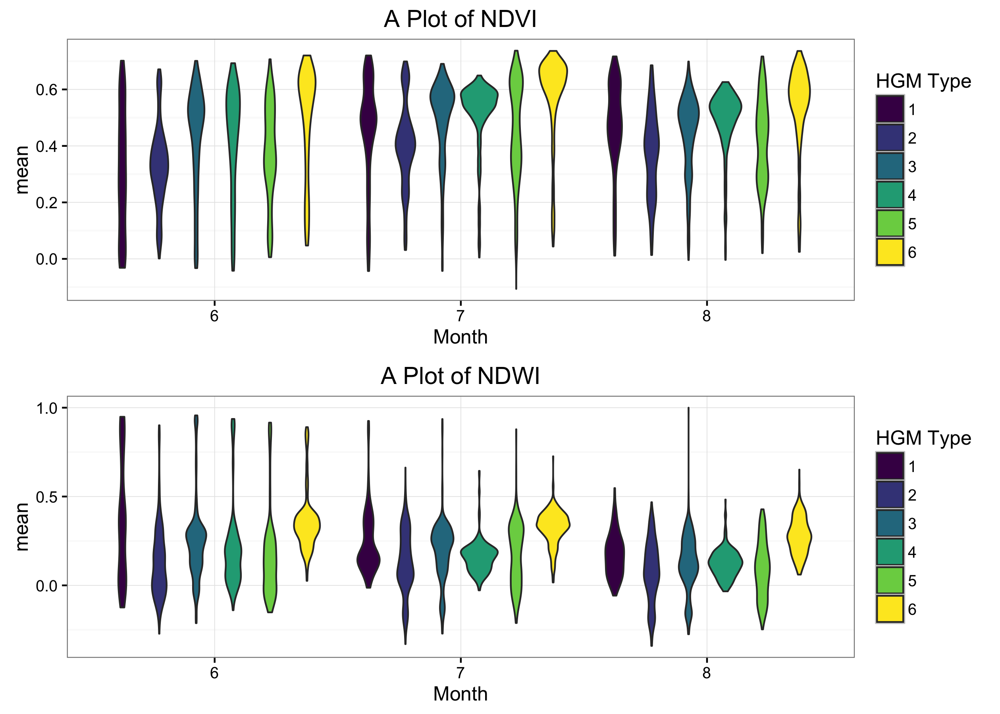

```{r setup, include=FALSE}
knitr::opts_chunk$set(echo = TRUE)
```

```{r load-libs, echo=FALSE}
suppressPackageStartupMessages({
  library(dplyr)
	library(ggplot2)
  library(viridis)
	library(ggthemes)
  library(lubridate)
	library(leaflet)
  library(readr)
  #library(quickmapr)
  library(rethinking)
  library(rgdal)
  library(DT)
  #library(ggrepel)
  })

# snmmc.mdws<-read_rds("./data_output/UCD_mdw_df.rds") # UCD Dataset for 17,039 meadows

#mod.hgm.mdws.gee<- read_rds("../data_output/mod_hgm_mdw_GEE.rds")

```

## Data Filtering and Merging

Take original data from previous and munge and merge with updated Dave Weixelman meadows that were selected.

```{r munge-orig-data, eval=F, echo=F}

wx.mdw<-read_rds("./data_output/wx_mdw_dat.rds") # weixelman data for 114 meadows

# rename and sort columns a bit
# Drop HGM source_type 8 (Dry), and combine classes 6 and 7, add elev col

wx.mdw <- wx.mdw %>% 
  select(PLOT, UCDavisObject_ID:PLOTNAME2, AREA_ACRE:Shape_Area) %>% 
  rename(Method=METHOD.y, UCDID=UCDavisObject_ID) %>% 
  mutate(hgm_class_comb = ifelse(source_type==8, NA, source_type), 
         hgm_class_comb = ifelse(source_type==7, 6, hgm_class_comb),
         elev_av_2100 = ifelse(ELEV_MEAN<2100, "<2100",">=2100"))

## make a quick meadows type table
mdw_types<-c("lacustrine fringe", "depressional",
             "discharge-slope-hillslope",
             "riparian-discharge-slope", "riparian",
             "subsurface-discharge-slope",
             "subsurface", "dry")
mdw_type_code<-c("lf", "dep", "ds", "rip-ds",
                 "rip", "sub-ds", "sub", "dry")
mdw_type_class<-seq(1,8,1)

# bind df
mdw_hgms<-data.frame("hgm_type"=mdw_types,"hgm_code"=mdw_type_code, "hgm_class"=mdw_type_class )

# now join this with original dataset
wx.mdw2<-inner_join(wx.mdw, mdw_hgms, by=c("source_type"="hgm_class"))
head(as.data.frame(wx.mdw2[,c(2,14,16,44:47)]))

# save for easy reload next time:
# write_rds(x = wx.mdw2, path ="~/Documents/github/meadow_hgm_waterchem/data_output/wx_mdw_dat2.rds")

```

First filter data to only selected data (`OK` and not `DRY` or `NOT OK`) based on Dave Weixelman's excel file from **June 05, 2016**. Several meadows were not accessible and were dropped, final list only includes data where there were UCDSNM_ID matched. Second, recombine and drop HGM classes (*drop dry category `8` and merge `6 & 7`*). Finally write back out as *.rds* file.

```{r load revised data, eval=F, echo=F}

wx.mdw<-read_rds("./data_output/wx_mdw_dat2.rds")

# this is the updated data version: 
wx.mdw.sub<-read_csv("./data/water_source_MDW_selection_2016_10_07.csv")
head(wx.mdw.sub)
wx.mdw.sub %>% ggplot + aes(x=hgm_classes, fill=elev_av_2100) + geom_bar()

# filter out the "NOT OK" and select cols of interest:
wx.mdw.sub <- wx.mdw.sub %>% 
  mutate(selected=1)
wx.mdw.sub %>% tally(selected) # should be 33 here!

# keep only selected and see how many matches occur:
dim(inner_join(wx.mdw, wx.mdw.sub, by="PLOT"))  # only 19 match up!
dim(inner_join(wx.mdw, wx.mdw.sub, by=c("UCDID"="UCDavisObject_ID")))  # 24 match up!
dim(merge(wx.mdw, wx.mdw.sub, by.x="UCDID", by.y="UCDavisObject_ID", all.y=T))

# this is the refiltered data...based on Dave's comments. Re-merge with dataset
wx.mdw.sub.UCID<-left_join(wx.mdw.sub, wx.mdw, by=c("UCDavisObject_ID"="UCDID")) %>% 
  distinct(UCDavisObject_ID,.keep_all = T) %>% 
  select(-ends_with(".y"), -c(STATE:Shape_Area)) %>% 
  rename_(.dots=setNames(names(.), gsub("\\.x", "", names(.))))

names(wx.mdw.sub.UCID)
summary(wx.mdw.sub.UCID)

# write to CSV and fill in blanks:
write_csv(wx.mdw.sub.UCID, path = "./data_output/wx_mdw_sub_UCID.csv")
# ok write this out to merge with GEE data later
# write_rds(x = wx.mdw.sub.UCID, path ="~/Documents/github/meadow_hgm_waterchem/data_output/wx_mdw_sub_UCDID.rds")
```

### Merge with Google Earth Engine Data

Need to merge with original GEE data after removing duplicated columns, then filter, rename a col, and save out.

```{r GEE clean and merge, eval=F, echo=F}
# HGM data ----
wx.mdw.sub<-read_csv(file = "./data_output/wx_mdw_sub_UCID.csv")
str(wx.mdw.sub)

# Make a list of duplicated column names (from SNMMC data) to filter from merge:
wx<-names(wx.mdw.sub)
gee<-names(snmmc.mdws)
allcols<-c(wx, gee)
col.dups <- allcols[duplicated(allcols)]

# now select columns that aren't duplicated before merging
library(magrittr) # to allow for special pipes %<>%
wx.mdw.sub %<>% select(-one_of(col.dups)) # writes back to same object
names(wx.mdw.sub)

# merge with GEE data
mdw.mod.dat<-inner_join(wx.mdw.sub, snmmc.mdws, by=c("UCDavisObject_ID"="ID"))
mdw.mod.dat %<>% select(-HGM_TYPE) %>%  dplyr::rename(., UCDID = UCDavisObject_ID)
names(mdw.mod.dat) # 47 variables, complete dataset

unique(mdw.mod.dat$UCDID) # should have 22!

## GET GEE DATA AND BIND NDVI w NDWI ------

folder='raw/'
get_csv <- list.files(folder, pattern = "*.csv")

mdws_gee <- data.frame()
for(i in 1:length(get_csv)) {
  csv<-read.csv(paste(folder,get_csv[i], sep=""), colClasses = "character")
  mdws_gee<-rbind(csv, mdws_gee)
  rm(csv)
  }

# Now Clean Up Rows
source(file='./scripts/functions/gee_data_cleanup.R')
# clean up df
mdws_gee_dat <- gee_tidy_df(mdws_gee)

#write_rds(mdws_gee_dat, path="./data_output/hgm_mdws_gee_dat.rds")
#mdws_gee_dat<-read_rds(path="./data_output/hgm_mdws_gee_dat.rds")

# remove temporary data
rm(mdws_gee)

## Filter and Join Mdws ------
mod.hgm.mdws.gee <- inner_join(mdw.mod.dat,mdws_gee_dat, by=c("UCDID"="ID"))
write_rds(mod.hgm.mdws.gee,"./data_output/mod_hgm_mdw_GEE.rds")
rm(snmmc.mdws, wx.mdw.sub, mdws_gee_dat)

```

### Final Dataset

The Weixelman dataset originally selected **24** meadows, of which there were only 17 unique UCD Meadow IDs, as several of the meadows (`PLOTNAME2`) actually fall within the same UCD ID. Merged these meadows with the NFWF Meadows to get final dataset, and am including some of the Kern high elevation sites (which are probably very difficult to visit, so may need to drop in future).

```{r get_water_year, eval=F, echo=F}

mod.hgm.mdws.gee<- read_rds("./data_output/mod_hgm_mdw_GEE.rds")
wx.mdws<-read_csv(file = "./data_output/wx_mdw_sub_UCID.csv")
str(wx.mdws)

# Add Water Year Cols
source("./scripts/functions/doy.R")

mod.hgm.mdws.gee$date<-ymd(mod.hgm.mdws.gee$date)
mod.hgm.mdws.gee$WY<-wtr_yr(mod.hgm.mdws.gee$date)
mod.hgm.mdws.gee$DOWY<-dowy(mod.hgm.mdws.gee$date)
mod.hgm.mdws.gee$DOY<-yday(mod.hgm.mdws.gee$date)
summary(mod.hgm.mdws.gee)

## GET SPATIAL DWR REGIONS FOR EACH MEADOW

dwr<- readOGR("./data/shps/DWR_HydrologicRegions-utm11.shp", layer="DWR_HydrologicRegions-utm11", verbose = F)
proj4string(dwr)

# Set Projection
wgs84<-CRS("+init=epsg:4326")
nad83<-CRS("+init=epsg:4269")
dwr<-spTransform(dwr, wgs84) # reproject
proj4string(dwr) # double check

# Get Attribute of DWR Polygon
library(dismo)
library(sp)

# make spatial dataframe of selected lat longs
xy <- mod.hgm.mdws.gee %>% distinct(UCDID, .keep_all = T) %>%
  dplyr::select(UCDID, LAT_DD, LONG_DD) 

xy.sp <- SpatialPoints(coords = xy[,c("LONG_DD", "LAT_DD")], proj4string = wgs84)
spdf.sp <- SpatialPointsDataFrame(xy.sp, xy)
str(spdf.sp)

plot(dwr) # this is slow
plot(spdf.sp, cex=2, col="red", pch=16, add=T) # this is slow
gg.dwr<-fortify(dwr)
xy.over<-cbind(xy, over(spdf.sp, dwr[,4:5]))
xy.over

## SO JUST COMBINE TO NORTH/SOUTH FOR NOW. GET TULARE DATA LATER
# South Lahontan/Tulare/: Use San Joaquin
# North Lahontan: Use Sacramento
xy.dwr <- xy.over %>% 
  mutate(dwr_name=ifelse(as.numeric(HR_CODE)==9 |
                           as.numeric(HR_CODE)==7, "SJR", "SAC"),
         dwr_code=ifelse(dwr_name=="SJR", 06, 05))
xy.dwr <- xy.dwr %>% dplyr::select(UCDID, HR_CODE:dwr_code)

# join this with full data set
mod.hgm <- inner_join(mod.hgm.mdws.gee, xy.dwr, by="UCDID")
names(mod.hgm)

## Add WYT
wy <- read.csv("./data/wy_type.csv")
wy <- dplyr::select(wy, WY, SAC_Index, SAC_maf_WYsum, SAC, SJ_maf_WYsum, SJ_Index, SJ)
head(wy)

## MERGE WITH FINAL DATA
mod.hgm <- inner_join(mod.hgm, wy, by="WY") # trims out 2016 b/c WY only to 2015

names(mod.hgm)

#write_rds(mod.hgm, path="./data_output/hgm_gee_mdws_dat.rds")

```

The final GEE dataset merged with Weixelman selected meadows gives us 22 meadows with unique UCDIDs, including 5 of the NFWF Meadows. See Table below for first few rows of dataset to see all variables.

```{r final dataset, eval=T, echo=T}

mod.hgm<-read_rds(path="../data_output/hgm_gee_mdws_dat.rds")
#names(mod.hgm)
DT::datatable(head(as.data.frame(mod.hgm)), 
              class="compact row-border stripe",
              caption=htmltools::tags$caption(
                style = 'caption-side: bottom; text-align: left;',
                htmltools::em('Table 1. '), 
                htmltools::em('First Few Rows of All Data Used for Model')))

```

#### HGM Types

The HGM Types were collapsed from the initial 8 to a final 6 types. See *Table 2 through Table 4* below for more information on the meadow HGM types, and which meadows were selected (by HGM type). 

```{r HGMtypes, eval=T, echo=F}
library(DT)

mdw_types<-c("lacustrine fringe", "depressional",
             "discharge-slope-hillslope",
             "riparian-discharge-slope", "riparian",
             "subsurface-discharge-slope",
             "subsurface", "dry")
mdw_type_code<-c("lf", "dep", "ds", "rip-ds",
                 "rip", "sub-ds", "sub", "dry")
mdw_type_class<-seq(1,8,1)

# bind df
mdw_hgms<-data.frame("hgm_type"=mdw_types,"hgm_code"=mdw_type_code, "hgm_class"=mdw_type_class )

DT::datatable(mdw_hgms, rownames = FALSE,
              class="compact row-border stripe",
              caption=htmltools::tags$caption(
                style = 'caption-side: bottom; text-align: center;',
                htmltools::em('Table 2. '), 
                htmltools::em('All HGM Types used from Weixelman et al. 2011')
              ), colnames = c("HGM Type"=1, "HGM Code"=2, "HGM Class"=3)
) %>% DT::formatStyle('HGM Type',  color = 'black', 
                  backgroundColor = 'lightblue', fontWeight = 'bold')

```

```{r hgmtypes_revised, eval=T, echo=F}

mdw_hgm_rev<-mdw_hgms[c(1:5,7),]
mdw_hgm_rev[6,3]<-6

# add counts of total meadows per group:
# mod.hgm  %>% distinct(UCDID,.keep_all = T) %>% group_by(hgm_class_comb)  %>% tally

mdw_hgm_rev$tot_mdws<-c(2,4,5,3,4,4)

# Table of HGM Types and Total Meadows per Type
DT::datatable(mdw_hgm_rev,rownames = FALSE,
              class="compact row-border stripe",
              caption=htmltools::tags$caption(
                style = 'caption-side: bottom; text-align: center;',
                htmltools::em('Table 3. '), 
                htmltools::em('Revised HGM Types for selection of meadows')
              ), colnames = c("HGM Type"=1, "HGM Code"=2, "HGM Class"=3, "Total Meadows"=4)
) %>% DT::formatStyle(columns = 'HGM Type',  color = 'black',fontWeight='bold') %>% 
  DT::formatStyle(columns = 'HGM Class',color = 'white', fontWeight = 'bold',
                  backgroundColor = styleInterval(cuts=c(1,2,3,4,5),
                                                  values = c("#440154FF", "#414487FF",
                                                             "#2A788EFF", "#22A884FF",
                                                             "#7AD151FF", "#FDE725FF")))


# Table of Each Meadow and HGM Type for that Meadow
DT::datatable(mod.hgm %>% distinct(PLOTNAME2, .keep_all = T) %>% select(UCDID,PLOTNAME2, hgm_type, hgm_class_comb), 
              rownames = TRUE,
              class="compact row-border stripe",
              caption=htmltools::tags$caption(
                style = 'caption-side: bottom; text-align: center;',
                htmltools::em('Table 4. '), 
                htmltools::em('Selected Meadows for HGM-LANDSAT Model')),
              colnames = c("RowID"=1, "Plot Name"=2, "UCD_ID"=3, "HGM Type"=4, "HGM Code"=5)) %>%
  DT::formatStyle(columns = 'HGM Code',color = 'white', fontWeight = 'bold',
                  backgroundColor = styleInterval(cuts=c(1,2,3,4,5),
                                                  values = c("#440154FF", 
                                                             "#414487FF",
                                                             "#2A788EFF", 
                                                             "#22A884FF",
                                                             "#7AD151FF",
                                                             "#FDE725FF"))
  )

```

## Plots

Finally, let's look at the data. This is NDVI and NDWI across 22 meadows for each HGM type for 3 months. Remember this is 30+ years (1984-2015) of 8-day LANDSAT composites, so distributions are very large. The total dataset is over 50,000 observations.

### Violin Plots

Violin plots are essentially boxplots showing densities or distributions over the data groups. Hard to interpret too much from these, but easier to understand the distribution of the data for each of these groupings (*HGM type and Month*) over all years (1984-2015).

```{r violin_plots, eval=F, echo=T}

mod.hgm$month <- month(mod.hgm$date)

# Violin Plots -------

# make a violin plot of NDVI
vio.ndvi<-ggplot(data=mod.hgm[mod.hgm$index=="NDVI" & mod.hgm$month>=6 & mod.hgm$month<9,], 
       aes(x=as.factor(month), y=mean, fill=as.factor(hgm_class_comb))) + 
  ggtitle("A Plot of NDVI") + xlab("Month") + guides(fill=guide_legend(title="HGM Type")) +
  geom_violin() + scale_fill_viridis(discrete = T) + 
  theme_bw() #+ facet_grid(month~.)

# make a violin plot of NDWI
vio.ndwi<-ggplot(data=mod.hgm[mod.hgm$index=="NDWI" & mod.hgm$month>=6 & mod.hgm$month<9,], 
       aes(x=as.factor(month), y=mean, fill=as.factor(hgm_class_comb))) + 
  ggtitle("A Plot of NDWI") + xlab("Month") + guides(fill=guide_legend(title="HGM Type")) +
  geom_violin() + scale_fill_viridis(discrete = T) + 
  theme_bw() #+ facet_grid(month~.)

vio_stack<-cowplot::plot_grid(vio.ndvi, vio.ndwi, align = "v",nrow = 2)
vio_stack

cowplot::save_plot("./fig_output/violin_ndvi_ndwi_jun-aug.png", plot = vio_stack, ncol = 2,base_aspect_ratio = 0.7, base_height = 6)


```



### Boxplots

Here are the same data (MEANS of LANDSAT DATA) with the same groupings using notched boxplots to assess if medians are significantly different. Notches are used to compare groups; if the notches of two boxes do not overlap, this suggests that the medians are significantly different.

```{r boxplots, eval=F, echo=T}

# Boxplots -------

# make a box plot of NDVI
box.ndvi<-ggplot(data=mod.hgm[mod.hgm$index=="NDVI" & mod.hgm$month>=6 & mod.hgm$month<9,], 
       aes(x=as.factor(month), y=mean, fill=as.factor(hgm_code))) + ylim(c(-0.2,1))+
  ggtitle("Boxplot of NDVI") + xlab("Month") + guides(fill=guide_legend(title="HGM Type")) +
  geom_boxplot(notch = T) + scale_fill_viridis(discrete = T) + 
  theme_bw() #+ facet_grid(month~.)

# make a box plot of NDWI
box.ndwi<-ggplot(data=mod.hgm[mod.hgm$index=="NDWI" & mod.hgm$month>=6 & mod.hgm$month<9,], 
       aes(x=as.factor(month), y=mean, fill=as.factor(hgm_code))) + ylim(c(-0.2,1))+
  ggtitle("Boxplot of NDWI") + xlab("Month") + guides(fill=guide_legend(title="HGM Type")) +
  geom_boxplot(notch = T) + scale_fill_viridis(discrete = T) + 
  theme_bw() #+ facet_grid(month~.)

box_stack<-cowplot::plot_grid(box.ndvi, box.ndwi, align = "v",nrow = 2)

box_stack

cowplot::save_plot("./fig_output/box_ndvi_ndwi_jun-aug.png", plot = box_stack, ncol = 2,base_aspect_ratio = 0.7, base_height = 6)

```


In this case, it's interesting that the NDVI seems to parse HGM types out more significantly than the NDWI data, with the exception of the *subsurface* and *subsurface-discharge slope* types, which seem to be more clearly different than anything else in the NDWI data. 

### Plots by Water Year Type

Now that we have the data, we can also assess how these data may fluctuate across meadows and water year types. See figures below of Water Year Type and mean NDVI/NDWI for each HGM type. 

It appears there is some signal in the data during summer months, particularly for the `Lacustrine Fringe` and `Riparian` HGM types. The `Discharge Slope` appears to have a very large amount of variation inherently in all months across years (water year types), but model will hopefully help delineate if some of this variation can be explained by HGM types and landsat data.

```{r plots by WYT, eval=F, echo=F, fig.height=4, fig.width=5}

# Relevel the Water Year Type into appropriate order:
mod.hgm$SAC <- factor(mod.hgm$SAC, levels = c("W", "AN", "BN", "D", "C"))
mod.hgm$SJ <- factor(mod.hgm$SJ, levels = c("W", "AN", "BN", "D", "C"))

# make a plot of NDWI
ggplot(data=mod.hgm[mod.hgm$index=="NDWI" & 
                      mod.hgm$month>5 & 
                      mod.hgm$month<9,], 
       aes(as.factor(month), mean, fill=as.factor(hgm_type))) + 
  ggtitle("A Plot of NDWI by Water Year Type") + ylim(c(-0.1,0.8)) +
  geom_boxplot(notch = T) + scale_fill_viridis(direction = 1, discrete = T) +
  theme_bw() + facet_grid(SAC~.) + ylab("Mean") + xlab("Month")+
  guides(fill=guide_legend(title="HGM Type"))

ggplot(data=mod.hgm[mod.hgm$index=="NDVI" & 
                      mod.hgm$month>5 & 
                      mod.hgm$month<9,], 
       aes(as.factor(month), mean, fill=as.factor(hgm_code))) + 
  ggtitle("A Plot of NDVI by Water Year Type") + ylim(c(-0.1,0.8)) +
  geom_boxplot(notch = T) + scale_fill_viridis(direction = 1, discrete = T) +
  theme_bw() + facet_grid(SAC~.) + ylab("Mean") + xlab("Month")+
  guides(fill=guide_legend(title="HGM Type"))


# look at trends across weeks and water years
ggplot() + geom_smooth(data=mod.hgm[mod.hgm$index=="NDVI" & 
                                      mod.hgm$month>5 & mod.hgm$month<9,], 
                       aes(x=DOWY, y=mean, color=hgm_code), se=F)+
  geom_point(data=mod.hgm[mod.hgm$index=="NDVI" & mod.hgm$month>5 &
                            mod.hgm$month<9,], 
             aes(x=DOWY, y=mean, color=hgm_code))+
  guides(color=guide_legend(title="HGM Type"))+
  theme_bw()+ xlab("Water Year Day (June 1 through June 30)") +
  scale_color_viridis(discrete = T) + facet_grid(SAC~.)

```

## Make a Shiny Map of Sites

```{r leaflet-mdws, message=F, echo=F}
library(leaflet)

wx.mdws<-read_csv(file = "../data_output/wx_mdw_sub_UCID.csv")

m <- leaflet() %>% addTiles() %>% 
  #setView(lng = -120.8, lat = 39, zoom = 8) %>%  # set to Auburn/Colfax, zoom 5 for CA 
  addTiles(group = "OSM") %>%
  addProviderTiles("Stamen.TopOSMFeatures", group = "OSM Features") %>%
  addProviderTiles("Esri.WorldImagery", group = "ESRI Aerial") %>%
  addProviderTiles("Thunderforest.Landscape", group = "Topo") %>%
  hideGroup("OSM Features") %>% 
  

# proposed sites
  addCircleMarkers(data=wx.mdws, group="Weixelman Sites",
                   lng= ~LONG_DD, lat= ~LAT_DD,
                   popup=paste0("<b>Plot:</b> ", 
                                wx.mdws$PLOTNAME2, "<br>", "<b>HGM Type:</b> ",
                                wx.mdws$hgm_type, "<br>", "<b>UCD_ID:</b> ",
                                wx.mdws$UCDavisObject_ID, 
                                "<br>", "<b>Area_acres:</b> ",
                                wx.mdws$AREA_ACRE, "<br>", "<b>Elev_mean_m:</b> ",
                                wx.mdws$ELEV_MEAN),
                   stroke=TRUE, weight=0.6,radius=10,
                   fillOpacity = 0.8, color="black",
                   fillColor = "yellow") %>%
  
  # add controls for basemaps and data
  addLayersControl(
    baseGroups = c("OSM", "ESRI Aerial", "Topo"),
    overlayGroups = c("Weixelman Sites",
                      "OSM Features"),
    options = layersControlOptions(collapsed = T))

# Print Map
m

```

# Modeling

Make a simple mode of HGM type vs. WY and NDVI or NDWI, adjusting for individual meadows. Scale data first.

```{r make model dat, eval=F, echo=T}

# let's take max value for July over all WY's 
dff <- mod.hgm %>% group_by(UCDID, WY, month) %>% 
  filter(index=="NDVI", month==7)
         #median==max(median, na.rm=T))
boxplot(dff$mean~dff$hgm_class_comb)

# Scale and center data:

# NDVI/NDWI
dff$lat_s<- (dff$LAT_DD - mean(dff$LAT_DD)) / sd(dff$LAT_DD)
dff$mdw_id<-coerce_index(dff$UCDID)

## NEED TO ADD WYTYPE TO THIS 
dff$sac_ind<-(dff$SAC_Index - mean(dff$SAC_Index)) / sd(dff$SAC_Index)
dff$wtyr_seq<-coerce_index(dff$WY)
dff$wtyrlag1<-dff$wtyr_seq-1 # lag 1 year
dff$edgecomplex_s<-(dff$EDGE_COMPL - mean(dff$EDGE_COMPL)) / sd(dff$EDGE_COMPL)
dff$domrock<-coerce_index(as.factor(dff$DOM_ROCKTY)) # shift factor to numeric
dff$vegmaj<-coerce_index(as.factor(dff$VEG_MAJORI)) # shift factor to numeric
dff$kf_s<-(dff$Kf - mean(dff$Kf)) / sd(dff$Kf)
dff$claytotR_s<-(dff$ClayTot_r - mean(dff$ClayTot_r)) / sd(dff$ClayTot_r)
dff$soilcomp<-coerce_index(as.factor(dff$COMP_NAME)) # shift factor to numeric
dff$flow_slope_s<-(dff$FLOW_SLOPE - mean(dff$FLOW_SLOPE)) / sd(dff$FLOW_SLOPE)
dff$elevmean_s<- (dff$ELEV_MEAN - mean(dff$ELEV_MEAN)) / sd(dff$ELEV_MEAN)
dff$catch_s<- (dff$CATCHMENT_ - mean(dff$CATCHMENT_)) / sd(dff$CATCHMENT_)
dff$shapearea_s<- (dff$Shape_Area - mean(dff$Shape_Area)) / sd(dff$Shape_Area)
dff$flowrange_s<- (dff$FLOW_RANGE - mean(dff$FLOW_RANGE))/ sd(dff$FLOW_RANGE)

# select to ndvi data only
names(dff)

ndvi<-dff %>%  
  select(UCDID, WY, month, mdw_id, mean, median, sac_ind, wtyr_seq,
         hgm_class_comb, lat_s, edgecomplex_s:flowrange_s)
summary(ndvi)

```

```{r setup model, eval=F, echo=T}

names(ndvi)

# make a list of names
# rename outcomes
dlist <- list(
  ndvi_mean=ndvi$mean,
  ndvi_median=ndvi$median,
  mdwID=ndvi$mdw_id,
  sac=ndvi$sac_ind,
  hgm = ndvi$hgm_class_comb, # hgm ID
  lat=ndvi$lat_s,
  kf = ndvi$kf_s,
  clay=ndvi$claytotR_s,
  #catcharea = ndvi$catch_s,
  elev=ndvi$elevmean_s
)

# START SIMPLE

m1a <- map2stan(
  alist(
    ndvi_mean ~ dnorm(mu, sigma), 
    mu <- a + a_mdwID[mdwID] + bhgm*hgm + belev*elev + bclay*clay +
      bkf*kf + bsac*sac + blat*lat,
    a ~ dnorm(0,10),
    a_mdwID[mdwID] ~ dnorm(0,sigma),
    sigma ~ cauchy(0,2),
    c(belev, bclay, bkf, bsac, blat) ~ dnorm(0,10),
    bhgm ~ dnorm(3,10)
  ),
  data=dlist, chains = 2, iter=5000, cores=2)


# look at estimates omitting varying effects output
precis( m1a , depth=2)

# rhats should be 1 or 1.00, and mean and STD should make sense (not wildly variable all over map).

summary(m1a) # see all 
plot(m1a) # see trace plots

par(mfrow=c(1,1))
plot(precis(m1a)) # see basic results with fixed effects
plot(precis(m1a, depth=2)) # see full results for each meadow
mtext("Varying effects model")
postcheck(m1a)

```

# Mixed Effect Model with Varying Intercepts for Different HGM types

```{r, eval=F, echo=F}


m1b<-map2stan(
  alist(
    ndvi ~ dnorm(mu,sigma),
    mu <- a + a_name + (b + b_name)*hgm,# + (b + b_name)*wtyr_typ,
    a ~ dnorm(0,100), # intercept
    b ~ dnorm(0,10), # slope
    c(a_name,b_name)[name] ~ dmvnorm2(0,sigma_name,Rho_name),
    sigma_name ~ dcauchy(0,1),
    Rho_name ~ dlkjcorr(2),
    sigma ~ dcauchy(0,1)),
  data=dlist, iter=1000, chains=2,cores=2)

precis( m1a , depth=2,
    pars=c("a","b","sigma_name","Rho_name") )

# rhats should be 1 or 1.00, and mean and STD should make sense (not wildly variable all over map). Correlations between slope and intercept (Rho_name 1,2 or vice versa) should potentially make sense too.


```


