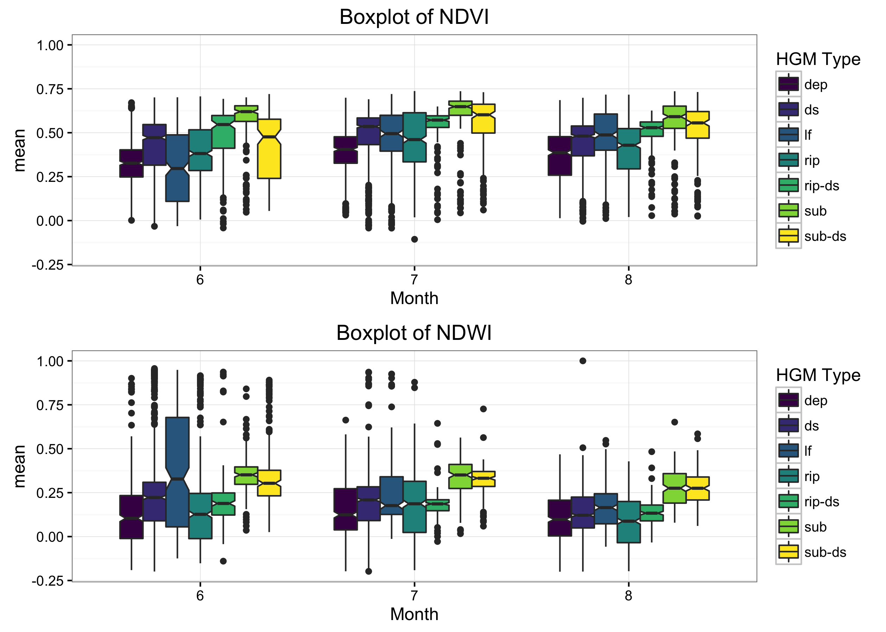

```{r setup, include=FALSE}
knitr::opts_chunk$set(echo = TRUE)
```

```{r load-libs, echo=FALSE}
suppressPackageStartupMessages({
  library(dplyr)
	library(ggplot2)
  library(viridis)
	library(ggthemes)
  library(lubridate)
	library(leaflet)
  library(readr)
  library(quickmapr)
  library(rethinking)
  library(rgdal)
  #library(ggrepel)
  })

#mdw.df<-read_rds("~/Documents/github/meadow_hgm_waterchem/data_output/UCD_mdw_df.rds") # UCD Dataset for 17,039 meadows

mdw.dat<-read_rds("~/Documents/github/meadow_hgm_waterchem/data_output/mdw_mod_GEE.rds")

```

# Data Filtering and Merging

Take original data from previous and munge and merge with updated Dave Weixelman meadows that were selected.

```{r munge-orig-data, eval=F, echo=T}

wx.mdw<-read_rds("~/Documents/github/meadow_hgm_waterchem/data_output/wx_mdw_dat.rds") # weixelman data for 114 meadows

# rename and sort columns a bit
# Drop HGM source_type 8 (Dry), and combine classes 6 and 7, add elev col

wx.mdw <- wx.mdw %>% 
  select(PLOT, UCDavisObject_ID:PLOTNAME2, AREA_ACRE:Shape_Area) %>% 
  rename(Method=METHOD.y, UCDID=UCDavisObject_ID) %>% 
  mutate(hgm_class_comb = ifelse(source_type==8, NA, source_type), 
         hgm_class_comb = ifelse(source_type==7, 6, hgm_class_comb),
         elev_av_2100 = ifelse(ELEV_MEAN<2100, "<2100",">=2100"))

## make a quick meadows type table
mdw_types<-c("lacustrine fringe", "depressional",
             "discharge-slope-hillslope",
             "riparian-discharge-slope", "riparian",
             "subsurface-discharge-slope",
             "subsurface", "dry")
mdw_type_code<-c("lf", "dep", "ds", "rip-ds",
                 "rip", "sub-ds", "sub", "dry")
mdw_type_class<-seq(1,8,1)

# bind df
mdw_hgms<-data.frame("hgm_type"=mdw_types,"hgm_code"=mdw_type_code, "hgm_class"=mdw_type_class )

# now join this with original dataset
wx.mdw2<-inner_join(wx.mdw, mdw_hgms, by=c("source_type"="hgm_class"))
head(as.data.frame(wx.mdw2[,c(2,14,16,44:47)]))

# save for easy reload next time:
write_rds(x = wx.mdw2, path ="~/Documents/github/meadow_hgm_waterchem/data_output/wx_mdw_dat2.rds")
```

First filter data to only selected data (`OK` and not `DRY` or `NOT OK`) based on Dave Weixelman's excel file from **June 05, 2016**. Several meadows were not accessible and were dropped, final list only includes data where there were UCDSNM_ID matched. Second, recombine and drop HGM classes (*drop dry category `8` and merge `6 & 7`*). Finally write back out as *.rds* file.

```{r load revised data, eval=F, echo=T}

wx.mdw<-read_rds("~/Documents/github/meadow_hgm_waterchem/data_output/wx_mdw_dat2.rds")

# easy ggplot
# wx.mdw %>% ggplot + aes(x=hgm_class_comb, fill=elev_av_2100) + geom_bar()

# this is the updated data version: 
wx.mdw.sub<-read_csv("~/Documents/github/meadow_hgm_waterchem/data/water_source_plot_selection_2016_06_05.csv")
head(wx.mdw.sub)

# filter out the "NOT OK" and select cols of interest:
wx.mdw.sub <- wx.mdw.sub %>% 
  mutate(selected=ifelse(Notes=="NOT OK" | Notes=="DRY", 0, 1)) %>% 
  filter(selected==1) 
wx.mdw.sub %>% tally(selected) # should be 26 here!

# keep only selected and see how many matches occur:
dim(inner_join(wx.mdw, wx.mdw.sub, by="PLOT"))  # only 19 match up!
dim(inner_join(wx.mdw, wx.mdw.sub, by=c("UCDID"="UCDavisObject_ID")))  # 24 match up!

# this is the refiltered data...based on Dave's comments. Re-merge with dataset
wx.mdw.sub.UCID<-inner_join(wx.mdw, wx.mdw.sub[,c(3,5,11,13)],
                            by=c("UCDID"="UCDavisObject_ID"))
wx.mdw.sub.UCID[2,48]<-6 # just make this a 6

# view the categories, note there are a few mismatches...ask Dave?
wx.mdw.sub.UCID %>% select(source_type.x,source_type.y, hgm_type, hgm_classes) %>% 
  as.data.frame()

# now re-format the hgm_class_comb column
wx.mdw.sub.UCID <- wx.mdw.sub.UCID %>% 
  mutate(hgm_class_comb = ifelse(source_type.y==8, NA, source_type.y), 
         hgm_class_comb = ifelse(source_type.y==7, 6, hgm_class_comb))

# ok write this out to merge with GEE data later
write_rds(x = wx.mdw.sub.UCID, path ="~/Documents/github/meadow_hgm_waterchem/data_output/wx_mdw_sub_UCDID.rds")
```

### Merge with Google Earth Engine Data

Need to merge with original GEE data after removing duplicated columns, then filter, rename a col, and save out.

```{r GEE data merge, eval=F, echo=T}
# HGM data
wx.mdw.sub<-read_rds(path = "~/Documents/github/meadow_hgm_waterchem/data_output/wx_mdw_sub_UCDID.rds")

# GEE aata
load(file = "data/mdw_geedat2.rda")

# Make a list of duplicated column names to filter from merge:
wx<-names(wx.mdw.sub)
gee<-names(mdws)
allcols<-c(wx, gee)
coldups <- allcols[duplicated(allcols)]

# now select columns that aren't duplicated before merging
library(magrittr) # to allow for special pipes %<>%
wx.mdw.sub %<>% select(-one_of(coldups), -source_type.x) # writes back to same object

# merge with GEE data
mdw.mod.dat<-inner_join(wx.mdw.sub, mdws, by=c("UCDID"="ID"))
mdw.mod.dat %<>% rename(source_type = source_type.y)
names(mdw.mod.dat)

write_rds(mdw.mod.dat, "~/Documents/github/meadow_hgm_waterchem/data_output/mdw_mod_GEE.rds")

```

## Final Dataset

The Weixelman dataset originally selected **24** meadows, of which there were only 17 unique UCD Meadow IDs, as several of the meadows (`PLOTNAME2`) actually fall within the same UCD ID. In addition, the original Google Earth Engine (*GEE*) dataset that we used did not contain a number of the UCDID's, probably because that data wasn't able to be pulled via the GEE. Need to follow up with Andy on that.

```{r dataset_subs}

# HGM data
wx.mdw.sub<-read_rds(path = "~/Documents/github/meadow_hgm_waterchem/data_output/wx_mdw_sub_UCDID.rds")

unique(wx.mdw.sub$UCDID)
unique(wx.mdw.sub$PLOTNAME2)

```

See below for stats. The final GEE dataset merged with Weixelman selected meadows gives us 9 meadows with unique UCDIDs. Fine for first cut of model. In comparing NDVI and NDWI, it appears only 5 HGM groups were retained, the subsurface HGM type didn't have any meadows selected and thus doesn't exist in this datase. See table for description of types from original through final GEE dataset.

```{r HGMtypes}
library(DT)

mdw_types<-c("lacustrine fringe", "depressional",
             "discharge-slope-hillslope",
             "riparian-discharge-slope", "riparian",
             "subsurface-discharge-slope",
             "subsurface", "dry")
mdw_type_code<-c("lf", "dep", "ds", "rip-ds",
                 "rip", "sub-ds", "sub", "dry")
mdw_type_class<-seq(1,8,1)

# bind df
mdw_hgms<-data.frame("hgm_type"=mdw_types,"hgm_code"=mdw_type_code, "hgm_class"=mdw_type_class )

DT::datatable(mdw_hgms, rownames = FALSE, autoHideNavigation = T,
              class="compact row-border stripe",
              caption=htmltools::tags$caption(
                style = 'caption-side: bottom; text-align: center;',
                htmltools::em('Table 1. '), 
                htmltools::em('All HGM Types used from Weixelman et al. 2011')
              ), colnames = c("HGM Type"=1, "HGM Code"=2, "HGM Class"=3)
) %>% DT::formatStyle('HGM Type',  color = 'black', 
                  backgroundColor = 'lightblue', fontWeight = 'bold')

```

```{r hgmtypes_revised}

mdw_hgm_rev<-mdw_hgms[c(1:5,7),]
mdw_hgm_rev[6,3]<-6
mdw_hgm_rev[6,3]<-6

DT::datatable(mdw_hgm_rev,rownames = FALSE,
              autoHideNavigation = T,
              class="compact row-border stripe",
              caption=htmltools::tags$caption(
                style = 'caption-side: bottom; text-align: center;',
                htmltools::em('Table 2. '), 
                htmltools::em('Revised HGM Types for selection of meadows')
              ), colnames = c("HGM Type"=1, "HGM Code"=2, "HGM Class"=3)
) %>% DT::formatStyle(columns = 'HGM Type',  color = 'black',fontWeight='bold') %>% 
  DT::formatStyle(columns = 'HGM Class',color = 'white', fontWeight = 'bold',
                  backgroundColor = styleInterval(cuts=c(1,2,3,4,5),
                                                  values = c("#440154FF", "#414487FF",
                                                             "#2A788EFF", "#22A884FF",
                                                             "#7AD151FF", "#FDE725FF")))

mdw_hgm_rev2<-mdw_hgm_rev[c(1:5),]
DT::datatable(mdw_hgm_rev2,rownames = FALSE,
              autoHideNavigation = T,
              class="compact row-border stripe",
              caption=htmltools::tags$caption(
                style = 'caption-side: bottom; text-align: center;',
                htmltools::em('Table 3. '), 
                htmltools::em('Revised HGM Types in final meadow dataset')
              ), colnames = c("HGM Type"=1, "HGM Code"=2, "HGM Class"=3)
) %>% DT::formatStyle(columns = 'HGM Type',  color = 'black',fontWeight='bold') %>% 
  DT::formatStyle(columns = 'HGM Class',color = 'white', fontWeight = 'bold',
                  backgroundColor = styleInterval(cuts=c(1,2,3,4),
                                                  values = c("#440154FF", "#3B528BFF",
                                                             "#21908CFF", "#5DC863FF",
                                                             "#FDE725FF")))

```

```{r violin_plots, eval=T, echo=F}

mdw.dat<-read_rds("~/Documents/github/meadow_hgm_waterchem/data_output/mdw_mod_GEE.rds")
unique(mdw.dat$PLOTNAME2) # 16 unique plot names but only 9 unique IDs
unique(mdw.dat$UCDID) # 16 unique plot names but only 9 unique IDs

# Violin Plots -------

# make a violin plot of NDVI
vio.ndvi<-ggplot(data=mdw.dat[mdw.dat$index=="NDVI" & mdw.dat$month>=6 & mdw.dat$month<9,], 
       aes(x=as.factor(month), y=mean, fill=as.factor(hgm_class_comb))) + 
  ggtitle("A Plot of NDVI") + xlab("Month") + guides(fill=guide_legend(title="HGM Type")) +
  geom_violin() + scale_fill_viridis(discrete = T) + 
  theme_bw() #+ facet_grid(month~.)

# make a violin plot of NDWI
vio.ndwi<-ggplot(data=mdw.dat[mdw.dat$index=="NDWI" & mdw.dat$month>=6 & mdw.dat$month<9,], 
       aes(x=as.factor(month), y=mean, fill=as.factor(hgm_class_comb))) + 
  ggtitle("A Plot of NDWI") + xlab("Month") + guides(fill=guide_legend(title="HGM Type")) +
  geom_violin() + scale_fill_viridis(discrete = T) + 
  theme_bw() #+ facet_grid(month~.)

vio_stack<-cowplot::plot_grid(vio.ndvi, vio.ndwi, align = "v",nrow = 2)
#cowplot::save_plot("./fig_output/violin_ndvi_ndwi_jun-aug.png", plot = vio_stack, ncol = 2,base_aspect_ratio = 0.7, base_height = 6)
#

```

```{r boxplots, eval=T, echo=F}

# Boxplots -------

# use notched boxplots to assess if medians are significantly different. Notches are used to compare groups; if the notches of two boxes do not overlap, this suggests that the medians are significantly different.

# make a box plot of NDVI
box.ndvi<-ggplot(data=mdw.dat[mdw.dat$index=="NDVI" & mdw.dat$month>=6 & mdw.dat$month<9,], 
       aes(x=as.factor(month), y=mean, fill=as.factor(hgm_class_comb))) + 
  ggtitle("Boxplot of NDVI") + xlab("Month") + guides(fill=guide_legend(title="HGM Type")) +
  geom_boxplot(notch = T) + scale_fill_viridis(discrete = T) + 
  theme_bw() #+ facet_grid(month~.)

# make a box plot of NDWI
box.ndwi<-ggplot(data=mdw.dat[mdw.dat$index=="NDWI" & mdw.dat$month>=6 & mdw.dat$month<9,], 
       aes(x=as.factor(month), y=mean, fill=as.factor(hgm_class_comb))) + 
  ggtitle("Boxplot of NDWI") + xlab("Month") + guides(fill=guide_legend(title="HGM Type")) +
  geom_boxplot(notch = T) + scale_fill_viridis(discrete = T) + 
  theme_bw() #+ facet_grid(month~.)

box_stack<-cowplot::plot_grid(box.ndvi, box.ndwi, align = "v",nrow = 2)

box_stack

#cowplot::save_plot("./fig_output/box_ndvi_ndwi_jun-aug.png", plot = box_stack, ncol = 2,base_aspect_ratio = 0.7, base_height = 6)

#

```

Use notched boxplots to assess if medians are significantly different. Notches are used to compare groups; if the notches of two boxes do not overlap, this suggests that the medians are significantly different.

### Plots by Water Year Type

Now that we have the data, we can also assess how these data may fluctuate across meadows and water year types. Below there are plots of Water Year Type and mean NDVI/NDWI for each HGM type. 

It appears there is some signal in the data during summer months, particularly for the `Lacustrine Fringe` and `Riparian` HGM types. The `Discharge Slope` appears to have a very large amount of variation inherently in all months across years (water year types), but model will hopefully help delineate if some of this variation can be explained by HGM types and landsat data.

```{r plots by WYT, eval=F, echo=F}

mdw.dat$SAC <- factor(mdw.dat$SAC, levels = c("W", "AN", "BN", "D", "C"))

# make a plot of NDWI
ggplot(data=mdw.dat[mdw.dat$index=="NDWI" & 
                      mdw.dat$month>5 & 
                      mdw.dat$month<9,], 
       aes(as.factor(month), mean, fill=as.factor(hgm_type))) + 
  ggtitle("A Plot of NDWI by Water Year Type") +
  geom_boxplot(notch = T) + scale_fill_viridis(direction = 1, discrete = T) +
  theme_bw() + facet_grid(SAC~.) + ylab("Mean") + xlab("Month")+
  guides(fill=guide_legend(title="HGM Type"))

ggplot(data=mdw.dat[mdw.dat$index=="NDVI" & 
                      mdw.dat$month>5 & 
                      mdw.dat$month<9,], 
       aes(as.factor(month), mean, fill=as.factor(hgm_code))) + 
  ggtitle("A Plot of NDVI by Water Year Type") +
  geom_boxplot(notch = T) + scale_fill_viridis(direction = 1, discrete = T) +
  theme_bw() + facet_grid(SAC~.) + ylab("Mean") + xlab("Month")+
  guides(fill=guide_legend(title="HGM Type"))


# look at trends across weeks and water years
ggplot() + geom_smooth(data=mdw.dat[mdw.dat$index=="NDVI" & 
                                      mdw.dat$month>5 & mdw.dat$month<9,], 
                       aes(x=wtyrwk, y=mean, color=hgm_class_comb))+
  geom_point(data=mdw.dat[mdw.dat$index=="NDVI" & mdw.dat$month>5 &
                            mdw.dat$month<9,], 
             aes(x=wtyrwk, y=mean, color=hgm_class_comb))+theme_bw()+
  scale_color_viridis(discrete = T) + facet_grid(SAC~.)

```

## Make a Shiny Map of Sites

```{r leaflet-mdws}
library(leaflet)

m <- leaflet() %>% addTiles() %>% 
  #setView(lng = -120.8, lat = 39, zoom = 8) %>%  # set to Auburn/Colfax, zoom 5 for CA 
  addTiles(group = "OSM") %>%
  addProviderTiles("Stamen.TopOSMFeatures", group = "OSM Features") %>%
  addProviderTiles("Esri.WorldImagery", group = "ESRI Aerial") %>%
  addProviderTiles("Thunderforest.Landscape", group = "Topo") %>%
  hideGroup("OSM Features") %>% 
  

# proposed sites
  addCircleMarkers(data=mdw.dat, group="Weixelman Sites",
                   lng= ~LONG_DD, lat= ~LAT_DD,
                   popup=paste0("<b>Plot:</b> ", 
                                mdw.dat$PLOTNAME2, "<br>", "<b>HGM Type:</b> ",
                                mdw.dat$hgm_type, "<br>", "<b>UCD_ID:</b> ",
                                mdw.dat$UCDID, "<br>", "<b>Area_acres:</b> ",
                                mdw.dat$AREA_ACRE, "<br>", "<b>HUC12:</b> ",
                                mdw.dat$HUC12, "<br>", "<b>Elev_mean_m:</b> ",
                                mdw.dat$ELEV_MEAN),
                   stroke=TRUE, weight=0.6,radius=10,
                   fillOpacity = 0.8, color="black",
                   fillColor = "yellow") %>%
  
  # add controls for basemaps and data
  addLayersControl(
    baseGroups = c("OSM", "ESRI Aerial", "Topo"),
    overlayGroups = c("Weixelman Sites","UCD Mdws",
                      "OSM Features"),
    options = layersControlOptions(collapsed = T))

# Print Map
m

```

```{r subset-WEIXmdws, eval=F, echo=F}
library(rgdal)
library(maps)
# mdw dataset
mdw.sp<- readOGR("/Users/ryanpeek/Documents/github/meadow_hgm_waterchem/data/shps/Sierra_Nevada_MultiSource_Meadow_Polygons_Compilation_v1_simplify10m.shp", layer="Sierra_Nevada_MultiSource_Meadow_Polygons_Compilation_v1_simplify10m", verbose = F)

wgs84<-CRS("+init=epsg:4326")
mdw.sp<-spTransform(mdw.sp, CRS(WGS84))
#mdw.df<-as.data.frame(mdw.sp)
wxmdw_list<-as.factor(unique(mdw.dat$UCDID)) # LIST OF WX MDWS

# Subset the full dataset extracting only the desired attributes
mdw.wx.sp <- subset(mdw.sp, ID %in% wxmdw_list)

plot(mdw.wx.sp)
map('state', 'california',add = T)
map('county', 'california',col="gray40", lty=2, add = T)

# Write to shp for GEE analysis
#writeOGR(mdw.wx.sp, "./data/shps/", "weix_mdws_hgm_UCD_v2", driver = "ESRI Shapefile")
```

```{r shiny WEIX mdws, eval=F, echo=F}
mdw.wx.sp<- readOGR("./data/shps/weix_mdws_hgm_UCD_v2.shp", layer = "weix_mdws_hgm_UCD_v2")

# make a leaflet map
m2 <- leaflet() %>% addTiles() %>% 
  #setView(lng = -120.8, lat = 39, zoom = 8) %>%  # set to Auburn/Colfax, zoom 5 for CA 
  addTiles(group = "OSM") %>%
  addProviderTiles("Esri.WorldImagery", group = "ESRI Aerial") %>%
  addProviderTiles("Thunderforest.Landscape", group = "Topo") %>% 
  
  # proposed sites
  addPolygons(data=mdw.wx.sp, group="Mdws", weight = 5,
              fillColor = "yellow", color="orange", fillOpacity = 0.6, 
              popup=paste0("MDW_ID: ", mdw.wx.sp@data$ID, "<br>", "Elev_Mean (m): ",
                           mdw.wx.sp@data$ELEV_MEAN)) %>%
  # add controls for basemaps and data
  addLayersControl(
    baseGroups = c("OSM", "ESRI Aerial", "Topo"),
    overlayGroups = c("Mdws"),
    options = layersControlOptions(collapsed = T))

# Print Map
m2

```

# Modeling

Make a simple mode of HGM type vs. WY and NDVI or NDWI, adjusting for individual meadows. Scale data first.

```{r make model dat, echo=T}

dff <- mdw.dat

# Scale and center data:
dff$mean_s<- (dff$mean - mean(dff$mean)) / sd(dff$mean) # wait til filtered for 

# NDVI/NDWI
dff$lat_s<- (dff$LAT_DD - mean(dff$LAT_DD)) / sd(dff$LAT_DD)
dff$name_id<-coerce_index(dff$UCDID)
dff$wtyr_typ<-coerce_index(dff$SAC)
dff$wtyr_seq<-coerce_index(dff$WY)
dff$wtyrlag1<-dff$wtyr_seq-1 # lag 1 year
dff$hgm_class_comb <- coerce_index(dff$hgm_class_comb) # shift to numeric
dff$edgecomplex_s<-(dff$EDGE_COMPL - mean(dff$EDGE_COMPL)) / sd(dff$EDGE_COMPL)
dff$domrock<-coerce_index(as.factor(dff$DOM_ROCKTY)) # shift factor to numeric
dff$vegmaj<-coerce_index(as.factor(dff$VEG_MAJORI)) # shift factor to numeric
dff$kf_s<-(dff$Kf - mean(dff$Kf)) / sd(dff$Kf)
dff$claytotR_s<-(dff$ClayTot_r - mean(dff$ClayTot_r)) / sd(dff$ClayTot_r)
dff$soilcomp<-coerce_index(as.factor(dff$COMP_NAME)) # shift factor to numeric
dff$flow_slope_s<-(dff$FLOW_SLOPE - mean(dff$FLOW_SLOPE)) / sd(dff$FLOW_SLOPE)
dff$elevmean_s<- (dff$ELEV_MEAN - mean(dff$ELEV_MEAN)) / sd(dff$ELEV_MEAN)
dff$catch_s<- (dff$CATCHMENT_ - mean(dff$CATCHMENT_)) / sd(dff$CATCHMENT_)
dff$shapearea_s<- (dff$Shape_Area - mean(dff$Shape_Area)) / sd(dff$Shape_Area)
dff$flowrange_s<- (dff$FLOW_RANGE - mean(dff$FLOW_RANGE))/ sd(dff$FLOW_RANGE)

# select to ndvi data only
names(dff)

ndvi<-dff %>% filter(index=="NDVI", WY>=2000) %>% 
  select(UCDID, name_id, mean, wtyr_typ, wtyr_seq,
         hgm_class_comb, edgecomplex_s:flowrange_s)

names(ndvi)
summary(ndvi)

```

```{r setup model}

# make a list of names
# rename outcomes
dlist <- list(
  ndvi=ndvi$mean,
  name=ndvi$name_id,
  wtyr_typ=ndvi$wtyr_typ,
  hgm = ndvi$hgm_class_comb # hgm ID
    #wtyr_seq=ndvi$wtyr_seq,
  #kf = ndvi$kf_s,
  #clay=ndvi$claytotR_s,
  #catcharea = ndvi$catch_s,
  #elev=ndvi$elevmean_s
)

# Mixed Effect Model with Varying Intercepts for Different Water Years

m1a<-map2stan(
  alist(
    ndvi ~ dnorm(mu,sigma),
    mu <- a + a_name + (b + b_name)*hgm,# + (b + b_name)*wtyr_typ,
    a ~ dnorm(0,100), # intercept
    b ~ dnorm(0,10), # slope
    c(a_name,b_name)[name] ~ dmvnorm2(0,sigma_name,Rho_name),
    sigma_name ~ dcauchy(0,1),
    Rho_name ~ dlkjcorr(2),
    sigma ~ dcauchy(0,1)),
  data=dlist, iter=1000, chains=2,cores=2)

# look at estimates omitting varying effects output
precis( m1a , depth=2 ,
    pars=c("a","b","sigma_name","Rho_name") )

# rhats should be 1 or 1.00, and mean and STD should make sense (not wildly variable all over map). Correlations between slope and intercept (Rho_name 1,2 or vice versa) should potentially make sense too.


#summary(m1a)
plot(m1a)
par(mfrow=c(1,1))
plot(precis(m1a))
precis(m1a)
plot(precis(m1a, depth=2))
mtext("Varying effects model")
postcheck(m1a)

```


