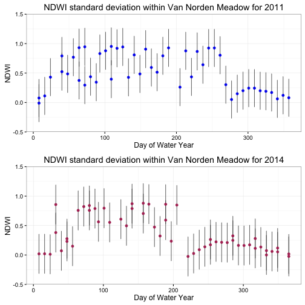

---
author: "Ryab"
date: "2016-08-09"
output:
 html_document:
   highlight: pygments
   theme: yeti
--- 

# Using Spin with R instead of Rmd
Updated: 2016-08-09

## Let's Write Some Notes on Meadow Modeling

The goal of the modeling is to identify relationships between water source 
(i.e., whether the meadow region in question is driven primarily *snow* or 
*groundwater*) and underlying hydrology/geomorphology. To identify potential
links, we will assess the strength of patterns associated with hydrogeomorphic
types (**HGM**), and water chemistry in conjunction with remote sensing data
from Google Earth Engine (NDVI and NDWI).

## Pilot Meadow: Van Norden

Van Norden is a large meadow at approximately 7,000 ft. 

## Load Required Packages
First step is to load libraries and data required for analysis.


```r
suppressPackageStartupMessages({
  library(plyr)
  library(dplyr)
	library(ggplot2)
	library(lubridate)
	library(leaflet)
  library(readr)
  })
```

## Get GEE Data and Merge with .dbf
First we need to load a giant dataset and cull the meadow of interest.
Pulling data from the git repo: `gee-meadows`
### Get Raw Data 


```r
source(file='scripts/functions/gee_data_cleanup.R')
ndvi<-read_csv(file = "raw/mdws_batch_NDVI_scale100_gt10.csv") # read in raw csv
ndwi<-read_csv(file = "raw/mdws_batch_NDWI_scale100_gt10.csv")
ndwi_df <- gee_tidy_df(ndwi) # clean up df
ndvi_df <- gee_tidy_df(ndvi)
data<-bind_rows(ndwi_df,ndvi_df) # bind both df together
rm(ndwi, ndvi, ndvi_df, ndwi_df) # remove temporary data
source("./scripts/functions/doy.R")
head(data)
data$date<-ymd(data$date)
data$WY<-wtr_yr(data$date)
data$DOWY<-dowy(data$date)
data$DOY<-yday(data$date)
saveRDS(data, file="data/UCD_mdws_GEE.rds") # save data this is 32.8 MB
#data<-readRDS("data/UCD_mdws_GEE.rds")
```

### Merge Meadow Data Raw Data 
Use the meadow NDVI and NDWI data and merge with the original dbf for plotting purposes


```r
mdws<-readRDS("data/UCD_mdws_GEE.rds")
library(foreign) # Bind to original SNMMP dbf
mdw_dbf <- read.dbf("data/base/Sierra_Nevada_MultiSource_Meadow_Polygons_Compilation_v1_simplify10m.dbf")
comb <- merge(mdws, mdw_dbf)
saveRDS(comb, file="data/UCD_mdws_SNMMPC.rds")
```

## Load Data and Plot
Take the Van Norden Meadow and calculate DOWY variance and plot.


```
## Warning: Removed 1 rows containing missing values (geom_errorbar).
```


NDVI is vegetation greeness, so differences are more pronounced during the growing
season. In 2011, there was more snow, which remained on the meadow longer and the
growing season started later, so values are actually lower earlier in the year. In
2014 the opposite was true, due to a very dry water year which actually permitted 
an earlier start to vegetation growth in the meadow.


```
## Warning: Removed 1 rows containing missing values (geom_errorbar).
```

```
## Warning: Removed 1 rows containing missing values (geom_point).
```



Now the plot should show some differences between NDVI in a wet year and a dry year
in Van Norden Meadow. What we need to do next is parse this out into proportion 
of HGM types, and build a model which will give us a distribution of probabilities 
associated with a given HGM type vs. NDVI or NDWI, during a given growing season.
Clear as the Little Colorado, I know.

## Do some More Writing

### BLah Blah Writing

### Did this work?


